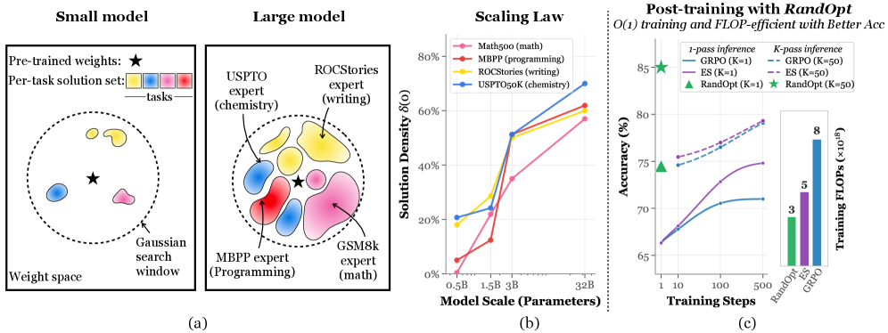

---
tags:
  - OPT
  - REASONING
  - THEORY
  - RL
arxiv: "https://arxiv.org/abs/2603.12228"
github: "https://github.com/sunrainyg/RandOpt"
website: "https://thickets.mit.edu"
year: 2026
read: false
---

# Neural Thickets: Diverse Task Experts Are Dense Around Pretrained Weights

> **Links:** [arXiv](https://arxiv.org/abs/2603.12228) | [GitHub](https://github.com/sunrainyg/RandOpt) | [Website](https://thickets.mit.edu)
> **Tags:** #OPT #REASONING #THEORY #RL

---

## Methodology

**Core Hypothesis (Neural Thickets):** Large, well-pretrained models are surrounded by a *dense* neighborhood of task-improving solutions ("neural thicket"), in contrast to small models where good solutions are rare ("needle in a haystack"). This density makes random-search-based post-training competitive with gradient-based RL.

### Formal Definitions

**Definition 2.1 — Solution Density:**

$$\delta(m) = \mathbb{P}_{\varepsilon \sim \mathcal{N}(0, \sigma^2 I)}\left[s(\theta + \varepsilon) \geq s(\theta) + m\right]$$

- $\theta$: pretrained weight vector; $\varepsilon$: isotropic Gaussian perturbation with scale $\sigma$.
- $s(\cdot)$: task score (e.g., accuracy); $m$: improvement margin over the base score $s(\theta)$.
- $\delta(m)$: the fraction of the neighborhood around $\theta$ that improves by at least $m$.

The probability that a random Gaussian perturbation improves the base model score by margin $m$. Empirically, $\delta$ increases monotonically with model scale (0.5B to 32B).

**Definition 2.2 — Spectral Discordance:**

$$\mathcal{D} = 1 - \frac{1}{M(M-1)} \sum_{j \neq k} C_{jk}$$

- $M$: number of tasks used to probe diversity; $j, k$: task indices.
- $C_{jk} \in [-1,1]$: rank-correlation of per-perturbation score improvements on tasks $j$ vs. $k$ — high $C_{jk}$ means the same perturbation helps both tasks.
- $\mathcal{D}$: 1 minus the average off-diagonal correlation; the complementary "how specialized are perturbations across tasks" signal. $\mathcal{D} \to 1$: perturbations are task-specific specialists (orthogonal rankings). $\mathcal{D} \to 0$: perturbations are generalists. Empirically, $\mathcal{D}$ is high, confirming that different perturbations improve different tasks.

### RandOpt Algorithm

**Phase 1 — Random Sampling and Selection:**

1. Sample $N$ random seeds $\{s_i\}_{i=1}^N$ and assign noise scales $\sigma_i \in \Sigma$.
2. Compute perturbed weights: $\theta_i = \theta + \sigma_i \cdot \varepsilon(s_i)$ where $\varepsilon(s_i) \sim \mathcal{N}(0, I)$ seeded by $s_i$.
3. Evaluate each $\theta_i$ on a small training set (200 samples) to obtain scores $v_i = s(\theta_i)$.
4. Select top-$K$ indices: $\mathcal{I}_\text{top} = \arg\text{topK}_{i \in [N]}(v_i)$.

**Phase 2 — Inference via Majority Voting:**

$$\hat{y} = \text{mode}\!\left(\left\{\arg\max_y f_{\theta_i}(y \mid x) \;\middle|\; i \in \mathcal{I}_\text{top}\right\}\right)$$

The top-$K$ perturbed models each generate a prediction; the final answer is the majority vote.

**Key properties:**
- **Fully parallel:** All $N$ model evaluations are independent — no sequential gradient steps.
- **Gradient-free:** No backpropagation; only forward passes.
- **O(1) training steps** (one round of selection) vs. O(T) for gradient methods.
- Only seeds and noise-scale values are stored (not full weight copies); actual $\theta_i$ is recomputed on the fly.

### Distillation (Optional)

To reduce inference cost from $K$ forward passes to one, top-$K$ model outputs are distilled into a single model via supervised fine-tuning on hard training examples:

$$\mathcal{L}_\text{Distill}(\theta) = -\sum_{t=t_x+1}^{T} \log p_\theta(s_t \mid x, s_{<t})$$

This adds ~2% additional FLOP cost and recovers most of the ensemble gain.

---

## Experiment Setup

- **Base models:** Qwen2.5-Instruct (0.5B, 1.5B, 3B, 7B, 14B, 32B), Qwen2.5-VL-3B-Instruct, OLMo-3-7B-Instruct
- **Benchmarks:** GSM8K, Countdown, MATH-500, OlympiadBench, MBPP, ROCStories, USPTO (patent claims), GQA (vision-language)
- **Training set:** First 200 samples of each benchmark's training split
- **Baselines:** PPO, GRPO, Evolution Strategies (ES)

**RandOpt Hyperparameters:**

| Hyperparameter | Value |
|---|---|
| Population size $N$ | 5,000 (main experiments) |
| Ensemble size $K$ | 50 |
| Noise scale $\sigma$ | 0.005 (landscape analysis); task-tuned otherwise |
| Selection set size | 200 training samples |

---

## Results

### Main Results: LLM Reasoning Tasks

RandOpt (K=50) vs. baselines. Scores are accuracy (%) on math/reasoning benchmarks.

| Model | Method | GSM8K | Countdown |
|---|---|---|---|
| Qwen2.5-1.5B-Inst. | Base | 58.8 | — |
| Qwen2.5-1.5B-Inst. | RandOpt (ensemble) | 76.4 | — |
| Qwen2.5-1.5B-Inst. | RandOpt (distilled) | 74.9 | — |
| Qwen2.5-3B-Inst. | Base | 79.8 | ~60 |
| Qwen2.5-3B-Inst. | RandOpt (ensemble) | 87.1 | 81.1 |
| Qwen2.5-3B-Inst. | RandOpt (distilled) | 84.3 | — |

*Distilled = single model trained via SFT on ensemble outputs, ~2% extra FLOP cost. Countdown is approximate from Figure 1(c).*

**Speed:** On 200 GH200 GPUs with $N=2000$, $K=50$, RandOpt reaches 70% Countdown accuracy (OLMo-3-7B) in **3.2 minutes**.

### Vision-Language Results (GQA)

| Model | Method | GQA Acc. (%) |
|---|---|---|
| Qwen2.5-VL-3B-Inst. | Base | 56.6 |
| Qwen2.5-VL-3B-Inst. | RandOpt | 69.0 |

*GQA = General Question Answering benchmark for visual question answering.*

### Scaling: Solution Density vs. Model Size

- $\delta$ increases monotonically from 0.5B to 32B (Qwen2.5-Instruct family).
- RandOpt **fails** to improve very small models (GPT-2, ~0.1B); gains emerge around 1.5B.
- Performance scales **log-linearly** with $N$ at fixed selection ratio $K/N$.

### Distillation Error Decomposition (GSM8K, Qwen2.5-3B)

| Error Type | Reduction |
|---|---|
| Reasoning errors | 12.3% |
| Format errors | 19.0% |

*Different perturbed models specialize in fixing different error types (reasoning vs. formatting), reflecting high spectral discordance.*

---

## Related Papers

- [justgrpo](justgrpo.md)
- [deepcrl](deepcrl.md)
