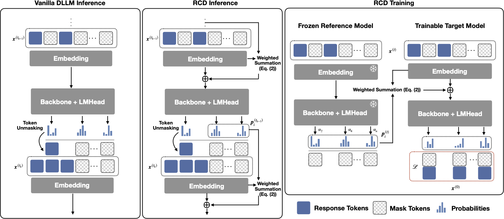

# RCD

> **Links:** [arXiv](https://arxiv.org/abs/2601.22954) | [GitHub](https://github.com/yuezhouhu/residual-context-diffusion) | [Website](https://yuezhouhu.github.io/projects/residual-context-diffusion/)
> **Tags:** #DLM #SPEC_DECODING

---

## Methodology

Residual Context Diffusion (RCD) keeps the standard blockwise diffusion decoding loop, but it no longer throws away the probability mass of remasked tokens. Instead, it converts those discarded distributions into soft residual context and injects them into the next denoising step.

Let $p_i^{(t)} \in \Delta^{|\mathcal V|}$ be the token distribution at position $i$ and denoising step $t$, and let $E \in \mathbb{R}^{|\mathcal V| \times d}$ be the input embedding codebook. RCD defines a residual soft token

$$
r_i^{(t)} = \sum_{v \in \mathcal V} p_i^{(t)}(v) E_v = {p_i^{(t)}}^\top E.
$$

For masked positions, the next-step input embedding interpolates between the static mask embedding and the residual:

$$
\tilde e_i^{(t+1)} = (1 - \alpha_i^{(t)}) E_{[M]} + \alpha_i^{(t)} r_i^{(t)}.
$$

The interpolation weight is the normalized Shannon entropy of the token distribution:

$$
\alpha_i^{(t)} = \frac{H\!\left(p_i^{(t)}\right)}{\log |\mathcal V|},
\qquad
H(p) = -\sum_{v \in \mathcal V} p(v)\log p(v).
$$

High-entropy low-confidence positions therefore contribute more residual signal than already-confident positions.

1. Train a lightweight **reference model** on the downstream dataset with the backbone dLLM masked-token objective.
2. Freeze the reference model and train a **target model**. For each noisy example, run the frozen reference model once, compute residual distributions and entropy weights, then inject those residual embeddings only at masked positions of the target input.
3. Optimize the target with the standard masked-token cross-entropy loss. The paper’s main point is that residual usage is learned without backpropagating through a full denoising unroll.
4. At inference time, warm-start the residual stream with the reference model once, then unload it and let the target model self-loop: each step produces logits, converts them into residual soft tokens, recomputes entropy weights, and injects them into the next step.
5. To reduce train-test mismatch, RCD applies a residual temperature scalar to the logits used for entropy estimation:

$$
\hat p_i^{(t)} = \mathrm{softmax}\!\left(\frac{z_i^{(t)}}{\tau_{\mathrm{res}}}\right),
$$

then computes $\alpha_i^{(t)}$ from $\hat p_i^{(t)}$ instead of the raw distribution.
6. For SDAR, the repo uses a small-to-large setup: `SeqD-SDAR-1.7B` is the reference model for `RCD-SDAR-4B/8B`, while LLaDA uses `SeqD-LLaDA-8B-Instruct` as the reference checkpoint.

The official minimal generation script is `generate_rcd.py` with `transformers==4.52.3`. For the public SDAR example, the repo uses `block_length=64`, `denoising_steps=64`, `temperature=0`, `confidence_threshold=0.85`, `latent_strategy=normalized-entropy-interpolation`, `alpha=1`, and dynamic remasking.

---

## Experiment Setup

### Training

| Setting | SDAR Family | LLaDA |
| --- | --- | --- |
| Backbone / init | SDAR chat checkpoints as targets; `SeqD-SDAR-1.7B` as frozen reference for 4B/8B targets | `LLaDA-8B-Base` target; `SeqD-LLaDA-8B-Instruct` reference |
| Training data | `OpenR1-Math-220k`, filtered to long-context samples $\ge 8\text{K}$ tokens | `OpenMathInstruct-2`, 1M-sample subset |
| Approx. token budget | `300M` | `400M` |
| Max sequence length | `8192` | `2048` |
| Epochs | `10` for the 1.7B reference, `5` for 4B/8B RCD targets | `5` |
| Optimizer | AdamW | AdamW |
| LR / scheduler | `1e-5`, `constant_with_warmup`, warmup ratio `0.03` | `1e-5`, cosine |
| Per-device batch | `1` | `2` |
| Gradient accumulation | `12` | `48` |
| Precision / scale | `bfloat16`, total batch size `96` on `8x H100` | `bfloat16`, FSDP, total batch size `768` on `8x H100` |

### Evaluation

- SDAR benchmarks: GSM8K, MATH500, AIME24, AIME25.
- LLaDA benchmarks: GSM8K and MinervaMath.
- Sequence length: SDAR uses `16384`; LLaDA uses `512` for standard tasks.
- Decoding: greedy for GSM8K, MATH500, and MinervaMath; AIME24/25 use `16`-sample `Pass@1`.
- SDAR repo eval defaults: `low_confidence_dynamic` remasking, `block_length=64`, `denoising_steps=64`, `top_p=1`, `top_k=0`, `temperature=0` for GSM8K / MATH500 and `0.6` for AIME.
- LLaDA repo eval: `gsm8k_cot` with `5` few-shot examples, `minerva_math` with `4` few-shot examples, `steps=512`, `block_size=512`, `max_new_tokens=512`, and `latent_logits_temperature=0.92` / `0.98`.

---

## Results

### Main Results

#### SDAR Accuracy

| Model | Variant | GSM8K | MATH500 | AIME24 | AIME25 |
| --- | --- | --- | --- | --- | --- |
| SDAR-4B-b32 | Chat | 86.13 | 50.20 | 5.83 | 2.50 |
| SDAR-4B-b32 | SeqD | 81.73 | 61.20 | 6.04 | 11.88 |
| SDAR-4B-b32 | RCD | 85.67 | 70.80 | 11.04 | 17.50 |
| SDAR-4B-b64 | Chat | 85.90 | 49.80 | 6.25 | 1.67 |
| SDAR-4B-b64 | SeqD | 78.85 | 56.80 | 4.17 | 7.29 |
| SDAR-4B-b64 | RCD | 84.76 | 67.80 | 13.75 | 15.83 |
| SDAR-8B-b32 | Chat | 88.40 | 50.00 | 6.46 | 4.17 |
| SDAR-8B-b32 | SeqD | 86.50 | 65.80 | 11.67 | 14.79 |
| SDAR-8B-b32 | RCD | 89.76 | 77.60 | 21.46 | 20.00 |
| SDAR-8B-b64 | Chat | 88.32 | 51.60 | 5.20 | 2.50 |
| SDAR-8B-b64 | SeqD | 82.87 | 64.20 | 7.08 | 9.79 |
| SDAR-8B-b64 | RCD | 88.70 | 73.60 | 15.00 | 19.79 |

The authors explicitly warn that SDAR-Chat GSM8K may be inflated by contamination; the cleaner comparison is SeqD vs. RCD after reasoning adaptation.

#### LLaDA Accuracy

| Model | Variant | GSM8K | MinervaMath |
| --- | --- | --- | --- |
| LLaDA | Base | 70.30 | 31.40 |
| LLaDA | SeqD | 75.74 | 31.10 |
| LLaDA | RCD | 78.09 | 37.00 |

#### Throughput-Matched Practical Inference

| Family | Dataset | Variant | Block Len | Gen Len | Tokens/s | Accuracy |
| --- | --- | --- | --- | --- | --- | --- |
| LLaDA / Fastdllm | MinervaMath | SeqD | 64 | 512 | 117.82 | 34.20 |
| LLaDA / Fastdllm | MinervaMath | RCD | 64 | 512 | 110.37 | 36.22 |
| LLaDA / Fastdllm | GSM8K | SeqD | 64 | 512 | 75.00 | 76.12 |
| LLaDA / Fastdllm | GSM8K | RCD | 64 | 512 | 65.56 | 78.70 |
| SDAR / D2F | MinervaMath | SeqD | 64 | 16384 | 130.54 | 50.82 |
| SDAR / D2F | MinervaMath | RCD | 64 | 16384 | 124.86 | 59.82 |
| SDAR / D2F | GSM8K | SeqD | 64 | 16384 | 149.45 | 75.36 |
| SDAR / D2F | GSM8K | RCD | 64 | 16384 | 148.41 | 81.43 |

Across confidence-threshold sweeps from `0.5` to `1.0`, the paper reports that RCD keeps a strictly better accuracy-vs.-tokens-per-step Pareto frontier and reaches up to `4-5x` lower computation at matched accuracy.

### Ablations

#### Low-Budget Training vs. Loopholing

| Model | Variant | GSM8K | MATH500 |
| --- | --- | --- | --- |
| SDAR-4B-b64 | Loopholing (1 epoch) | NA | NA |
| SDAR-4B-b64 | RCD (1 epoch) | 85.90 | 66.80 |

#### Saturation Analysis on SDAR-8B-b64

| Variant | GSM8K | MATH500 | AIME24 | AIME25 |
| --- | --- | --- | --- | --- |
| SeqD (Extended, 8 epochs) | 84.61 | 68.00 | 8.96 | 10.83 |
| RCD (5 epochs) | 88.70 | 73.60 | 15.00 | 19.79 |

---

## Related Papers

- [sdar](sdar.md)
- [wino](wino.md)