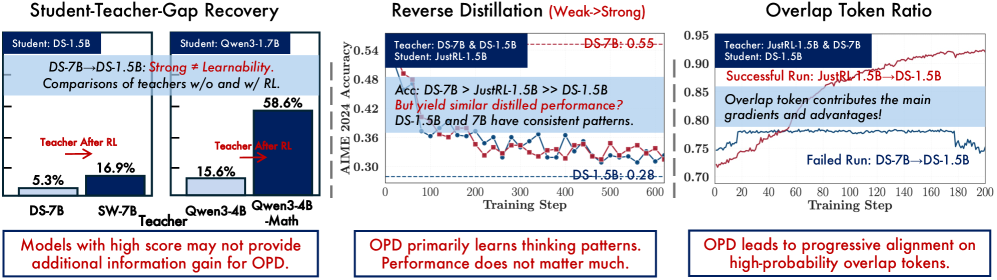
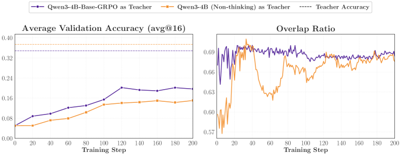
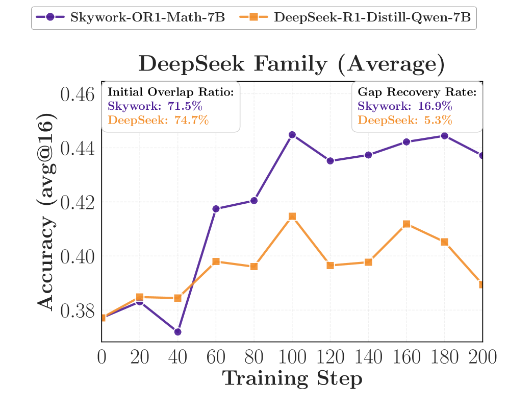
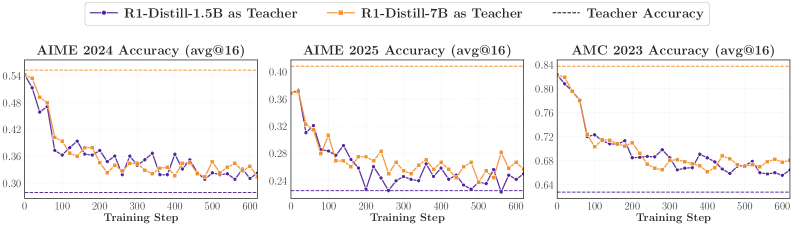
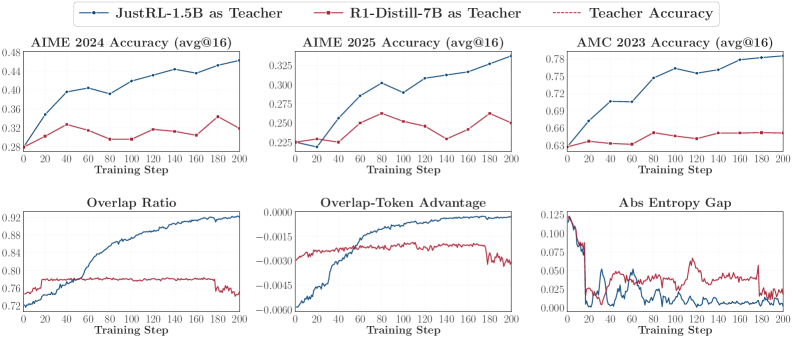
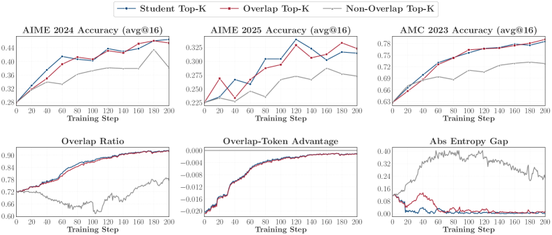
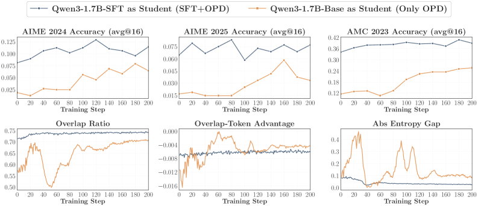
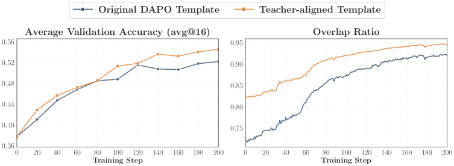

---
tags:
  - RL
  - REASONING
  - NLP
  - THEORY
arxiv: https://arxiv.org/abs/2604.13016
github: https://github.com/thunlp/OPD
website: ""
year: 2026
read: false
---

# Rethinking On-Policy Distillation of Large Language Models: Phenomenology, Mechanism, and Recipe

> **Links:** [arXiv](https://arxiv.org/abs/2604.13016) | [GitHub](https://github.com/thunlp/OPD)
> **Tags:** #RL #REASONING #NLP #THEORY

---

## Methodology

*Figure 1: Overview. The paper dissects when On-Policy Distillation (OPD) works via three dynamic metrics — student–teacher gap recovery, reverse KL, and top-$k$ overlap ratio — and traces success/failure to high-probability-token alignment at student-visited states.*

On-Policy Distillation trains a student LLM $\pi_\theta$ on trajectories sampled from $\pi_\theta$ **itself**, not from a fixed teacher-generated dataset. At each step the student samples $\hat{y} \sim \pi_\theta(\cdot \mid x)$ and the loss minimizes the sequence-level reverse KL to the teacher evaluated on the student's own prefix:

$$\mathcal{L}_{\mathrm{OPD}}(\theta) = \mathbb{E}_{x \sim \mathcal{D}_x,\; \hat{y} \sim \pi_\theta(\cdot \mid x)} \left[ \sum_{t=1}^{T} D_{\mathrm{KL}}(p_t \| q_t) \right]$$

- $p_t(v) \triangleq \pi_\theta(v \mid x, \hat{y}_{<t})$: student next-token distribution at step $t$.
- $q_t(v) \triangleq \pi_T(v \mid x, \hat{y}_{<t})$: teacher distribution evaluated on the student-generated prefix.
- $T$: rollout length; $v \in \mathcal{V}$: vocabulary token.
- $D_{\mathrm{KL}}(p_t \| q_t)$: per-token **reverse** KL (student-mode-seeking — student is the first argument).

### Three Implementation Variants

| Variant | Loss | Memory | Notes |
|---|---|---|---|
| **Sampled-Token** | $\log p_t(\hat{y}_t) - \log q_t(\hat{y}_t)$ | $O(BT)$ | Unbiased MC estimator of per-token reverse KL |
| **Full-Vocabulary** | $\sum_{v \in \mathcal{V}} p_t(v)\log\frac{p_t(v)}{q_t(v)}$ | $O(BTM)$ | Exact; memory-prohibitive for large vocab $M$ |
| **Top-$k$** | $D_{\mathrm{KL}}(\bar{p}_t^{(S_t)} \| \bar{q}_t^{(S_t)})$ | $O(BTk)$ | Subset KL on student top-$k$ set $S_t = \operatorname{TopK}(p_t, k)$ |

*$B$: batch size; $T$: sequence length; $M$: vocab size; $k$: top-$k$ cutoff; $\bar{p}_t^{(S_t)}, \bar{q}_t^{(S_t)}$: student/teacher distributions renormalized over $S_t$.*

---

## Phenomenology: Two Conditions for OPD Success

### Condition 1 — Thinking-pattern consistency

Student and teacher must share compatible reasoning patterns. A thinking-pattern mismatch weakens the token-level signal **regardless** of the teacher's benchmark advantage.

*Figure 2: Same student (Qwen3-1.7B-Base), two teachers. The GRPO teacher (thinking-pattern match) achieves both stronger validation accuracy (left) and higher initial/maintained overlap ratio (right) than the non-thinking teacher.*

### Condition 2 — New knowledge, not just scale

The teacher must possess capabilities the student has **not** already encountered in training. A larger same-family model produces no gains — or regresses — if it carries no genuinely new knowledge; an RL-post-trained teacher does.

*Figure 3: DeepSeek family. An RL-post-trained teacher (Skywork-OR1-Math-7B) delivers a 16.9% gap-recovery rate vs. only 6.4% for the same-pipeline DeepSeek-R1-Distill-7B — despite a comparable/lower initial overlap ratio. New capability, not scale, drives gains.*

### Validation via reverse distillation

Distilling a strong student **back** from a weaker same-family teacher confirms the mechanism: the teacher is distributionally indistinguishable from the student, so OPD drags performance back down toward the teacher.

*Figure 4: JustRL-1.5B (post-RL student) distilled from same-family R1-Distill-1.5B and R1-Distill-7B teachers. Both teachers — even the larger, higher-scoring 7B — cause the student to regress toward its pre-RL accuracy, since neither carries new knowledge.*

---

## Mechanism: High-Probability-Token Alignment

Three dynamic metrics, monitored over training:

$$\mathcal{M}_{\text{overlap}} \triangleq \mathbb{E}_{t} \left[ \frac{|S_t^{(p)} \cap S_t^{(q)}|}{k} \right]$$

$$\mathcal{M}_{\text{adv}} \triangleq \mathbb{E}_{t}\!\left[ \frac{1}{|S_t^{(p)} \cap S_t^{(q)}|} \sum_{v \in S_t^{(p)} \cap S_t^{(q)}} \bar{p}_t(v)\bigl(\log \bar{q}_t(v) - \log \bar{p}_t(v)\bigr) \right]$$

$$\Delta H_t = \left| H(q_t) - H(p_t) \right|$$

- $S_t^{(p)} = \operatorname{TopK}(p_t, k)$, $S_t^{(q)} = \operatorname{TopK}(q_t, k)$: student and teacher top-$k$ token sets at step $t$.
- $\mathcal{M}_{\text{overlap}}$: **overlap ratio** — fraction of shared top-$k$ tokens; rises from ~72% → ~91% in successful runs.
- $\mathcal{M}_{\text{adv}}$: **overlap-token advantage** — student-weighted log-ratio of teacher vs. student within shared tokens; → 0 when aligned, large negative when student is overconfident there.
- $\Delta H_t$: **entropy gap** — absolute per-step entropy mismatch; small in successful runs.
- Overlap tokens carry **97%–99%** of combined probability mass throughout training, success or failure.

*Figure 5: Successful (RL-post-trained teacher) vs. failing (same-pipeline teacher) OPD for the same student (R1-Distill-1.5B). Success shows rising accuracy, climbing overlap ratio, overlap advantage → 0, and a shrinking entropy gap; failure stalls on all four.*

### Optimizing shared tokens alone suffices

Restricting the loss to the **overlap** of student and teacher top-$k$ sets matches full Student-Top-$k$ OPD; the non-overlap tokens contribute almost nothing.

*Figure 6: Top-$k$ support ablation. "Overlap Top-$k$" tracks "Student Top-$k$" on accuracy and all dynamic metrics, while "Non-Overlap Top-$k$" is substantially weaker — the learning signal lives on the shared high-probability tokens.*

---

## Practical Recipe

### Strategy 1 — Off-policy cold start

1. Sample 200K prompts from the math subset of OpenThoughts3-1.2M.
2. Generate one teacher rollout per prompt (Qwen3-4B Non-thinking; temp=0.7, top-p=0.95, max 12,288 tok); filter incomplete/repetitive outputs.
3. SFT the student on filtered pairs (LLaMA-Factory, full-parameter) → Qwen3-1.7B-SFT.
4. Run OPD on remaining ~30K deduplicated prompts. SFT-init starts with a higher overlap ratio and reaches substantially higher final accuracy than pure OPD from base.

*Figure 7: Off-policy cold start before OPD (fixed teacher Qwen3-4B Non-thinking). The SFT-warmed student starts and stays at a higher overlap ratio, training more stably and reaching higher accuracy than OPD from base.*

### Strategy 2 — Leverage teacher post-training prompts

- Use prompts from the teacher's post-training set (e.g., DAPO-Math-17K for a GRPO-trained teacher) and match the **exact** prompt template used during teacher post-training.
- Risk: teacher-aligned content concentrates mass on shared tokens but suppresses student entropy — mix with OOD prompts to preserve exploration.

*Figure 8: Prompt template alignment. The teacher-aligned template yields both higher accuracy and faster overlap-ratio growth than the mismatched original DAPO template throughout training.*

---

## Experiment Setup

**Student models:** Qwen3-1.7B-Base, Qwen3-1.7B (Non-thinking), R1-Distill-1.5B, R1-Distill-7B, JustRL-1.5B.

**Teacher models:** Qwen3-4B (Non-thinking), Qwen3-4B-Base-GRPO, R1-Distill-7B, Skywork-OR1-Math-7B, Qwen3-4B-Non-Thinking-RL-Math, R1-Distill-1.5B.

**Training data:** DAPO-Math-17K (default OPD); OpenThoughts3-1.2M math subset (cold-start SFT).

**Benchmarks:** AIME 2024, AIME 2025, AMC 2023. **Metric:** avg@16 (temp=0.7, top-p=0.95, max 31,744 tok). **Hardware:** 8× A800 80 GB.

---

## Results

### Training Hyperparameters

| Hyperparameter | GRPO Teacher Training | Default OPD |
|---|---|---|
| Base model | Qwen3-4B-Base | — |
| Epochs | 1 | 1 |
| Global batch size | 64 | 64 |
| Rollout $n$ | 8 | 4 |
| LogProb top-$k$ | — | 16 |
| Top-$k$ strategy | — | Student Top-$k$ |
| Max prompt length | 1,024 | 1,024 |
| Max response length | 7,168 | 7,168 |
| Learning rate | $1 \times 10^{-6}$ | $1 \times 10^{-6}$ |
| Temperature | 1.0 | 1.0 |
| KL coefficient | 0.0 | 0.0 |

### Main Findings (reported as training curves)

| Student | Teacher | Condition | Outcome |
|---|---|---|---|
| Qwen3-1.7B-Base | Qwen3-4B-Base-GRPO | High overlap (thinking match) | Consistent improvement on all 3 benchmarks |
| Qwen3-1.7B-Base | Qwen3-4B (Non-thinking) | Low overlap (thinking mismatch) | Weaker gains; early gap not recovered |
| R1-Distill-1.5B | Skywork-OR1-Math-7B | RL post-trained teacher (new knowledge) | Large gains; high gap recovery |
| R1-Distill-1.5B | R1-Distill-7B | Same-pipeline larger model | Little to no improvement |
| JustRL-1.5B | R1-Distill-1.5B | Teacher = student's pre-RL checkpoint | Regression to pre-RL performance |
| JustRL-1.5B | R1-Distill-7B | Larger same-family, higher-scoring | Same regression as the weaker 1.5B teacher |

*Gap recovery rate $= (Acc_{\text{after}} - Acc_{\text{before}}) / (Acc_{\text{teacher}} - Acc_{\text{before}})$.*

### Ablations

| Ablation | Setting | Effect |
|---|---|---|
| **Cold start** | No cold start (base init) | Low start overlap, unstable, baseline accuracy |
| | 200K off-policy SFT cold start | High start overlap, stable, substantially better |
| **Prompt template** | Mismatched (DAPO) format | Lower overlap, baseline accuracy |
| | Teacher-aligned template | Higher overlap, better on all 3 benchmarks |
| **Prompt content** | OOD content (DeepMath subset) | Higher overlap, higher entropy, baseline |
| | Teacher-aligned (DAPO-Math-17K) | Lower overlap but high shared-mass; lower entropy (collapse risk); best when mixed with OOD |
| **Top-$k$ support** | Overlap Top-$k$ | Matches full Student Top-$k$ |
| | Non-Overlap Top-$k$ | Substantially weaker |

---

## Related Papers

- [draft-opd](draft-opd.md)
