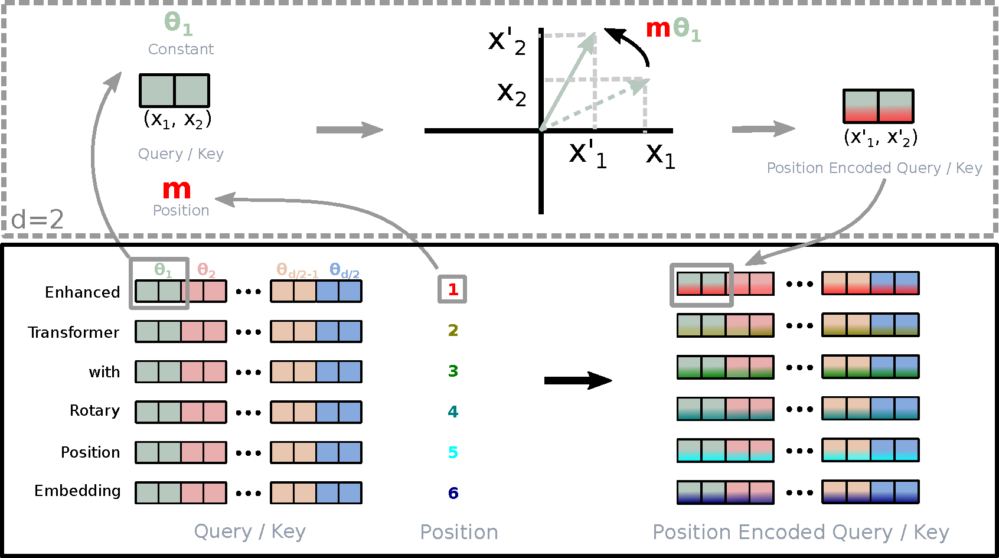

---
tags:
  - NLP
  - DEEP_LEARNING
arxiv: https://arxiv.org/abs/2104.09864
github: https://github.com/ZhuiyiTechnology/roformer
website: https://huggingface.co/docs/transformers/model_doc/roformer
year: 2021
read: false
---

# RoFormer: Enhanced Transformer with Rotary Position Embedding

> **Links:** [arXiv](https://arxiv.org/abs/2104.09864) | [GitHub](https://github.com/ZhuiyiTechnology/roformer) | [HuggingFace](https://huggingface.co/docs/transformers/model_doc/roformer)
> **Tags:** #NLP #DEEP_LEARNING

---

## Methodology

### Problem Formulation

Given input tokens $\{w_i\}_{i=1}^N$ with embeddings $\{\mathbf{x}_i\}_{i=1}^N$ where $\mathbf{x}_i \in \mathbb{R}^d$, the goal is to find position-encoding functions $f_q, f_k$ such that the query-key inner product depends only on the relative position $m - n$:

$$\langle f_q(\mathbf{x}_m, m),\ f_k(\mathbf{x}_n, n)\rangle = g(\mathbf{x}_m, \mathbf{x}_n, m-n)$$

- $\mathbf{x}_m, \mathbf{x}_n \in \mathbb{R}^d$: word embeddings at positions $m$ and $n$.
- $g$: the desired function whose output depends on relative position only.

### Rotary Position Embedding (RoPE)

**2D case:** The solution in $d=2$ using complex-number geometry is:

$$f_{\{q,k\}}(\mathbf{x}_m, m) = (\mathbf{W}_{\{q,k\}}\mathbf{x}_m)\, e^{im\theta}$$

where multiplication by $e^{im\theta}$ rotates the projected vector by angle $m\theta$.

**General form ($d$ even):** The embedding space is split into $d/2$ 2D sub-spaces, each rotated independently:

$$f_{\{q,k\}}(\mathbf{x}_m, m) = \mathbf{R}^d_{\Theta,m}\,\mathbf{W}_{\{q,k\}}\mathbf{x}_m$$

where $\mathbf{R}^d_{\Theta,m}$ is a block-diagonal rotation matrix with pre-defined parameters $\Theta = \{\theta_i = 10000^{-2(i-1)/d},\ i \in [1, \ldots, d/2]\}$ (same frequency schedule as original sinusoidal PE).

- $\mathbf{R}^d_{\Theta,m}$: orthogonal matrix -- preserves vector norms, ensuring stable encoding.
- Each $2 \times 2$ block rotates the $i$-th pair of dimensions by angle $m\theta_i$.

**Resulting attention inner product:**

$$\mathbf{q}_m^\top \mathbf{k}_n = (\mathbf{R}^d_{\Theta,m}\mathbf{W}_q\mathbf{x}_m)^\top(\mathbf{R}^d_{\Theta,n}\mathbf{W}_k\mathbf{x}_n) = \mathbf{x}_m^\top \mathbf{W}_q^\top \mathbf{R}^d_{\Theta,n-m} \mathbf{W}_k \mathbf{x}_n$$

- $\mathbf{R}^d_{\Theta,n-m} = (\mathbf{R}^d_{\Theta,m})^\top \mathbf{R}^d_{\Theta,n}$: depends only on the relative offset $n-m$.

### Efficient Computation

The sparsity of $\mathbf{R}^d_{\Theta,m}$ admits an element-wise realization avoiding a full matrix multiply:

$$\mathbf{R}^d_{\Theta,m}\mathbf{x} = \begin{pmatrix}x_1\\\vdots\\x_{d-1}\\x_d\end{pmatrix}\otimes\begin{pmatrix}\cos m\theta_1\\\cos m\theta_1\\\vdots\\\cos m\theta_{d/2}\\\cos m\theta_{d/2}\end{pmatrix} + \begin{pmatrix}-x_2\\x_1\\\vdots\\-x_d\\x_{d-1}\end{pmatrix}\otimes\begin{pmatrix}\sin m\theta_1\\\sin m\theta_1\\\vdots\\\sin m\theta_{d/2}\\\sin m\theta_{d/2}\end{pmatrix}$$

- $\otimes$: element-wise (Hadamard) product.
- Complexity $O(d)$ per token; no $d\times d$ matrix allocation needed.

### Properties

**Long-term decay:** $|\mathbf{q}_m^\top \mathbf{k}_n|$ provably decreases as $|m-n|$ grows (proven via Abel's summation). This matches the linguistic intuition that distant token pairs should receive less attention weight.

**Linear attention compatibility:** RoPE composes with any linear-attention kernel $\phi$ by applying rotation after the kernel:

$$\text{Attn}(\mathbf{Q},\mathbf{K},\mathbf{V})_m = \frac{\sum_n \big(\mathbf{R}^d_{\Theta,m}\phi(\mathbf{q}_m)\big)^\top\big(\mathbf{R}^d_{\Theta,n}\varphi(\mathbf{k}_n)\big)\mathbf{v}_n}{\sum_n \phi(\mathbf{q}_m)^\top\varphi(\mathbf{k}_n)}$$

- $\phi(\cdot), \varphi(\cdot)$: non-negative kernel functions (e.g., $\text{elu}(x)+1$); denominator is kept unrotated to avoid division-by-zero.
- Maintains $O(N)$ complexity of linear attention while adding relative position encoding.

---

## Experiment Setup

| Component | Configuration |
|---|---|
| Base model (EN) | BERT-base-uncased (12L, 768H, 12A) |
| Pre-training data (EN) | BookCorpus + Wikipedia (Huggingface) |
| Pre-training data (ZH) | ~34 GB Chinese Wikipedia, news, forums |
| Pre-training optimizer | AdamW, lr=1e-5, batch=64, 100k steps, max seq len=512 |
| GLUE fine-tuning | 3 epochs, max seq len=512, batch=32, lr in {2,3,4,5}e-5 |
| MT (WMT14 En-De) | 37k BPE vocab, fairseq; Adam beta=(0.9,0.98), lr warmup to 5e-4 then inv-sqrt decay, label smoothing=0.1, beam=4, length penalty=0.6, last-5 checkpoint average |
| Linear attn (Performer) | 12L, 768H, 12A on Enwik8; lr=1e-4, batch=128, max seq len=1024 |
| Hardware | 2 servers x 4x V100 |

---

## Results

### Machine Translation (WMT 2014 En-De, BLEU)

| Model | BLEU |
|---|---|
| Transformer-base | 27.3 |
| **RoFormer** | **27.5** |

### GLUE Fine-tuning (English)

| Model | MRPC | SST-2 | QNLI | STS-B | QQP | MNLI-m/mm |
|---|---|---|---|---|---|---|
| BERT | 88.9 | **93.5** | **90.5** | 85.8 | 71.2 | **84.6/83.4** |
| RoFormer | **89.5** | 90.7 | 88.0 | **87.0** | **86.4** | 80.2/79.8 |

*MRPC and QQP: F1. STS-B: Spearman correlation. SST-2, QNLI, MNLI: accuracy. MNLI-m/mm: matched/mismatched.*

### Chinese Long Text -- CAIL2019-SCM (% accuracy)

| Model | Max Seq Len | Validation | Test |
|---|---|---|---|
| BERT | 512 | 64.13 | 67.77 |
| WoBERT | 512 | 64.07 | 68.10 |
| RoFormer | 512 | 64.13 | 68.29 |
| **RoFormer** | **1024** | **66.07** | **69.79** |

*CAIL2019-SCM: 8,964 legal case triplets (A, B, C) from Chinese Supreme Court; task predicts whether (A,B) is more similar to A than (A,C). Documents typically exceed 512 characters. RoFormer-1024 gains +1.5% absolute over WoBERT-512 on validation by generalizing to longer context via RoPE's built-in sequence-length flexibility.*

### Chinese Pre-training Stages (RoFormer, MLM on ~34 GB Chinese data)

| Stage | Max Seq Len | Batch | Steps | MLM Loss | MLM Accuracy |
|---|---|---|---|---|---|
| 1 | 512 | 256 | 200k | 1.73 | 65.0% |
| 2 | 1536 | 256 | 12.5k | 1.61 | 66.8% |
| 3 | 256 | 256 | 120k | 1.75 | 64.6% |
| 4 | 128 | 512 | 80k | 1.83 | 63.4% |
| 5 | 1536 | 256 | 10k | 1.58 | 67.4% |
| 6 | 512 | 512 | 30k | 1.66 | 66.2% |

*Multi-stage curriculum with varying sequence lengths (128-1536). Because RoPE has no learned positional parameters, the model adapts to unseen lengths without positional embedding re-initialization.*
