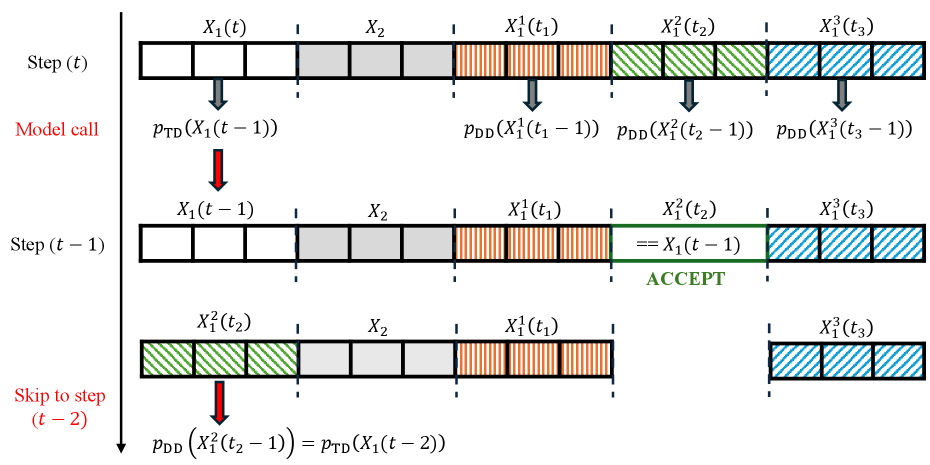
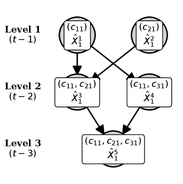
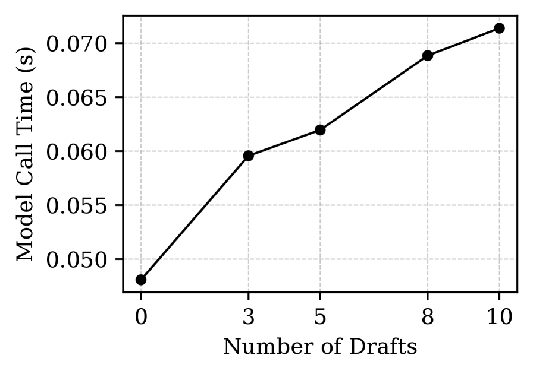

---
tags:
  - DLM
  - SPEC_DECODING
arxiv: https://arxiv.org/abs/2509.18085
github: ""
website: ""
year: 2025
read: false
---

# Spiffy: Multiplying Diffusion LLM Acceleration via Lossless Speculative Decoding

> **Links:** [arXiv](https://arxiv.org/abs/2509.18085)
> **Tags:** #DLM #SPEC_DECODING

---

## Methodology

*Figure 1: Lossless verification process. At each timestep, Spiffy samples a candidate state from the model's output distribution, then checks whether each draft block matches — accepted blocks skip all future denoising steps.*

Spiffy applies speculative decoding to diffusion LLMs (dLLMs), which operate via **iterative masked-token denoising** rather than autoregressive generation. The core challenge: dLLMs use bidirectional attention, so they do not naturally decompose into a cheap draft / expensive verifier pair as in AR speculative decoding.

### Draft Generation with Directed Draft Graphs

Instead of a separate small draft model, Spiffy reuses the **dLLM's own output distribution** at an early denoising timestep to propose draft token sequences.

A **directed draft graph** encodes which draft token blocks to evaluate:

- Each node is a (position, token) pair.
- Directed edges from parent to child: a child block is proposed only if its parent block is accepted.
- Multiple parent edges per child create multiple acceptance paths — graphs (not trees) are used because bidirectional attention allows attending to any position.

*Figure 2: Directed draft graph structure. Each box is a candidate token block; arrows represent conditional parent-child dependencies. Multiple paths exist so a child can be accepted via any accepted parent.*

### Offline Calibration

The graph topology is determined once offline:

1. Run the target dLLM on $N = 20$–50 calibration samples.
2. At each denoising step, sort unmasked tokens by **position rank** (how early unmasked) and **vocabulary rank** (probability rank under the model).
3. Identify high-frequency $k$-grams in the unmasking order; these become draft graph edges.
4. Calibration completes in $<30$ minutes on a single GPU; the graph is reused for all future inference.

### Lossless Verification

At each denoising timestep $t$:

1. Run the full model forward pass to obtain logits.
2. Sample a complete token assignment from the model's conditional distribution:

$$\hat{x}_t \sim p_\theta(\cdot \mid x_{t+1})$$

- $\hat{x}_t$: sampled token assignment at step $t$.
- $p_\theta$: target dLLM with parameters $\theta$.
- $x_{t+1}$: the more-masked token sequence from the previous denoising step.

3. For each draft block in topological order: if the block's proposed tokens match $\hat{x}_t$ at those positions, mark the block *accepted* (those positions skip all remaining timesteps).
4. Unaccepted positions continue denoising normally.

This is **provably lossless** — accepted tokens are drawn from the exact marginal distribution of the dLLM. Verification overhead is 1.8–2.4% of model inference time.

---

## Experiment Setup

- **Models:** LLaDA-Base-8B, LLaDA-Instruct-8B, LLaDA-1.5-8B
- **Block size:** 32 tokens (block-wise decoding)
- **Generation length:** 256 tokens
- **Draft blocks:** $D \in \{0, 3, 5, 8, 10\}$ ($D=0$ = no-Spiffy baseline)
- **Speedup metric:** reduction in Number of Function Evaluations (NFEs)
- **Calibration:** 20–50 task-specific samples, single GPU, $<30$ min
- **Benchmarks:** GSM8K (exact match), HumanEval (pass@1), MBPP (pass@1), MATH (exact match)

---

## Results

### Main Results (Table 1)

Format: speedup / accuracy. $D=0$ is the baseline at $1\times$.

**LLaDA-Base-8B:**

| Dataset | D=0 | D=3 | D=5 | D=8 | D=10 |
|---------|-----|-----|-----|-----|------|
| GSM8K (exact match) | 1.00× / 0.71 | 2.24× / 0.72 | 2.50× / 0.68 | 2.74× / 0.69 | 2.80× / 0.68 |
| HumanEval (pass@1) | 1.00× / 0.45 | 2.40× / 0.42 | 2.71× / 0.42 | 3.00× / 0.45 | 3.07× / 0.45 |
| MBPP (pass@1) | 1.00× / 0.37 | 2.39× / 0.36 | 2.70× / 0.37 | 2.97× / 0.38 | 3.06× / 0.38 |
| MATH (exact match) | 1.00× / 0.25 | 2.27× / 0.25 | 2.54× / 0.23 | 2.79× / 0.25 | 2.88× / 0.23 |

**LLaDA-Instruct-8B:**

| Dataset | D=0 | D=3 | D=5 | D=8 | D=10 |
|---------|-----|-----|-----|-----|------|
| GSM8K | 1.00× / 0.56 | 2.37× / 0.55 | 2.68× / 0.54 | 2.95× / 0.51 | 3.04× / 0.53 |
| HumanEval | 1.00× / 0.50 | 2.29× / 0.52 | 2.56× / 0.54 | 2.80× / 0.54 | 2.88× / 0.52 |
| MBPP | 1.00× / 0.37 | 2.30× / 0.38 | 2.58× / 0.38 | 2.84× / 0.37 | 2.93× / 0.35 |
| MATH | 1.00× / 0.24 | 2.28× / 0.24 | 2.57× / 0.22 | 2.79× / 0.25 | 2.89× / 0.24 |

**LLaDA-1.5-8B:**

| Dataset | D=0 | D=3 | D=5 | D=8 | D=10 |
|---------|-----|-----|-----|-----|------|
| GSM8K | 1.00× / 0.65 | 2.40× / 0.62 | 2.70× / 0.63 | 2.96× / 0.68 | 3.06× / 0.67 |
| HumanEval | 1.00× / 0.56 | 2.29× / 0.53 | 2.57× / 0.53 | 2.81× / 0.53 | 2.90× / 0.52 |
| MBPP | 1.00× / 0.37 | 2.32× / 0.38 | 2.60× / 0.39 | 2.83× / 0.39 | 2.93× / 0.38 |
| MATH | 1.00× / 0.25 | 2.30× / 0.26 | 2.59× / 0.26 | 2.82× / 0.29 | 2.90× / 0.26 |

> Accuracy is preserved within ±1 standard error across all $D$, consistent with the losslessness proof.

### Combined Speedup with Parallel Decoding (Table 2)

LLaDA-Instruct-8B, HumanEval, $D=8$ draft blocks.

| Parallel Decoding Setting | Baseline | +Spiffy | pass@1 |
|--------------------------|----------|---------|--------|
| default (1 token/step) | 1.00× | 2.95× | 0.52±0.05 |
| hard-code=2 | 2.00× | 3.74× | 0.43±0.05 |
| hard-code=4 | 4.00× | 5.28× | 0.29±0.05 |
| threshold=0.9 | 3.32× | 5.18× | 0.50±0.05 |
| threshold=0.8 | 4.69× | 6.84× | 0.48±0.05 |
| threshold=0.7 | 6.43× | **7.88×** | 0.45±0.05 |

> hard-code=$k$: unmask exactly $k$ tokens per step (lossy). threshold=$\tau$: unmask all tokens with model confidence $\geq \tau$ per step (lossy). Spiffy is lossless and stacks multiplicatively on both.

### Overhead Analysis (Table 3)

Each component shown as % of model inference time. $D=0$ is no-Spiffy baseline.

| Component | D=0 | D=3 | D=5 | D=8 | D=10 |
|-----------|-----|-----|-----|-----|------|
| Vocab sort | 1.6% | 3.8% | 3.8% | 3.6% | 3.3% |
| Pos sort | 188.0% | 179.0% | 181.0% | 179.0% | 177.0% |
| Drafting | 0.0% | 0.3% | 0.4% | 0.5% | 0.5% |
| Mask | 0.0% | 0.2% | 0.2% | 0.2% | 0.3% |
| Pos ids | 0.0% | 0.2% | 0.2% | 0.2% | 0.3% |
| Verify | 0.0% | 1.8% | 2.0% | 2.4% | 2.3% |

> "Pos sort" at ~180% is pre-existing block-wise position sorting, not introduced by Spiffy. Spiffy-specific overhead (Drafting + Mask + Pos ids + Verify) is 0.5–3.4% of model time.

### Speedup Scaling

*Figure 3: Inference time vs. number of draft blocks $D$. Speedup grows with $D$ but saturates, reflecting the draft block acceptance rate under the model's distribution.*

---

## Related Papers

- [llada20](llada20.md)
- [llada21](llada21.md)
- [wino](wino.md)
- [eagle3](eagle3.md)
- [medusa](medusa.md)
- [ecdlm](ecdlm.md)
- [idlm](idlm.md)
- [mdlm](mdlm.md)
