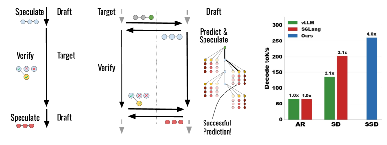

---
tags:
  - SPEC_DECODING
  - MLSYS
  - THEORY
arxiv: https://arxiv.org/abs/2603.03251
github: https://github.com/tanishqkumar/ssd
website: ""
year: 2026
read: false
---

# Speculative Speculative Decoding

> **Links:** [arXiv](https://arxiv.org/abs/2603.03251) | [GitHub](https://github.com/tanishqkumar/ssd)
> **Tags:** #SPEC_DECODING #MLSYS #THEORY

---

## Methodology

Standard speculative decoding (SD) has a sequential bottleneck: the draft model cannot begin the next speculation until verification completes. **Speculative Speculative Decoding (SSD)** breaks this by running the draft model *during* verification, pre-computing speculations for likely verification outcomes.

### Core Idea

Let $S$ be the verification outcome (which tokens were accepted). During the target model's verification forward pass, the draft model predicts the distribution over $S$ and generates speculative continuations for the top-$K$ most probable outcomes. When verification finishes:
- **Cache hit**: $S$ is in the pre-computed cache — return the pre-computed draft tokens immediately with zero additional latency.
- **Cache miss**: fall back to a secondary speculator.

### Saguaro: Three-Component Algorithm

**1. Cache Construction (Section 4.1) — Geometric Fan-Out**

The cache assigns a fan-out $F_k$ (number of cached alternatives) to each draft position $k$. Empirically, cache miss rates follow a power law:

$$1 - p_{\text{hit}}(F) = \frac{1}{F^r}$$

- $p_{\text{hit}}(F)$: probability that the true outcome is in the cache given fan-out $F$.
- $F$: number of cached alternatives at a given position.
- $r$: power-law exponent (dataset/model dependent, estimated empirically).

Optimal fan-out under a budget $B = \sum_k F_k$ follows a geometric schedule:

$$F_k = F_0 \cdot a_p^{k/(1+r)}$$

- $F_0$: fan-out at position 0 (largest, since early positions have higher acceptance probability).
- $a_p$: token acceptance rate of the primary speculator.
- $k$: draft position index ($k = 0, 1, \ldots, \gamma-1$ where $\gamma$ is the speculation length).

This allocation achieves up to **90% cache hit rate** in practice.

**2. Saguaro Sampling (Section 4.2)**

To concentrate probability mass on cached tokens, tokens already in the cache are down-weighted by a constant $C \in [0, 1]$ during draft sampling:

$$q'(x) \propto \begin{cases} C \cdot q(x) & x \in \text{cache} \\ q(x) & x \notin \text{cache} \end{cases}$$

- $q(x)$: original draft distribution over vocabulary.
- $C$: down-weighting constant; lower $C$ increases cache hit rate at the cost of acceptance rate.
- Residual probability mass is redistributed to non-cached tokens, keeping the corrected distribution valid for speculative decoding acceptance.

**3. Saguaro Fallback (Section 4.3) — Adaptive Secondary Speculator**

On a cache miss, Saguaro switches between two backup strategies based on batch size $b$:
- $b < b^*$: use a high-quality neural draft model.
- $b \geq b^*$: use a fast (arithmetic/retrieval-based) backup speculator.

$b^*$ is the analytically derived batch-size threshold where the fast speculator's throughput advantage outweighs quality loss.

### Theoretical Speedup (Theorem 7)

$$\text{speedup}_{\text{SSD}} = \frac{p_{\text{hit}} \cdot \mathbb{E}[\text{tokens}_{\text{hit}}] + (1 - p_{\text{hit}}) \cdot \mathbb{E}[\text{tokens}_{\text{miss}}]}{p_{\text{hit}} \cdot \max(1, T_p) + (1 - p_{\text{hit}}) \cdot (1 + T_b)}$$

- $p_{\text{hit}}$: cache hit probability.
- $\mathbb{E}[\text{tokens}_{\text{hit/miss}}]$: expected tokens generated on cache hit / miss.
- $T_p, T_b$: latency of primary and backup speculators, normalized to verification latency.

---

## Experiment Setup

| Component | Detail |
|---|---|
| Target model | Llama-3.1-70B |
| Primary draft model | Llama-3.2-1B |
| Hardware | 4×H100 (target), 1×H100 (draft, separate device) |
| Batch size | 1 (latency regime) |
| Decoding | Greedy |
| Datasets | Alpaca, GSM8K, UltraFeedback, HumanEval |

**Baselines:** autoregressive decoding; standard speculative decoding (SD) with Llama-3.2-1B.

---

## Results

### Main Results

| Method | Speedup vs AR | Speedup vs SD |
|---|---|---|
| Speculative Decoding (SD) | ~3.8× | 1.0× (baseline) |
| Saguaro (SSD) | up to **5×** | **~1.3×** (+30%) |

*Averaged across Alpaca, GSM8K, UltraFeedback, HumanEval at batch size 1, greedy decoding on Llama-3.1-70B.*

### Cache Performance

| Metric | Value |
|---|---|
| Cache hit rate (geometric fan-out) | up to 90% |
| Miss-rate model | power law: $1 - p_{\text{hit}}(F) = F^{-r}$ |
| Geometric vs. uniform fan-out benefit | most pronounced at higher temperatures |

### Pareto Frontier

Saguaro improves the **throughput-latency Pareto frontier** relative to SD, with the largest gains at low batch sizes where latency is the bottleneck.

---

## Related Papers

- [eagle3](eagle3.md)
- [sdar](sdar.md)
- [rcd](rcd.md)
- [vllm](vllm.md)
