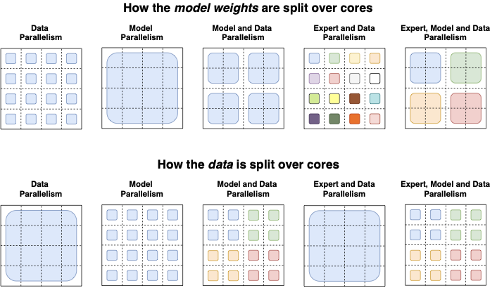

---
tags:
  - NLP
  - MLSYS
  - DEEP_LEARNING
arxiv: https://arxiv.org/abs/2101.03961
github: "https://github.com/google-research/t5x"
website: ""
year: 2022
read: false
---

# Switch Transformers: Scaling to Trillion Parameter Models with Simple and Efficient Sparsity

> **Links:** [arXiv](https://arxiv.org/abs/2101.03961) | [GitHub (T5X)](https://github.com/google-research/t5x) | [GitHub (TF Mesh)](https://github.com/tensorflow/mesh/blob/master/mesh_tensorflow/transformer/moe.py)
> **Tags:** #NLP #MLSYS #DEEP_LEARNING

---

## Methodology

Switch Transformer replaces the dense Feed-Forward Network (FFN) in each Transformer layer with a **sparse Switch FFN** layer consisting of $N$ expert networks. Each token is independently routed to exactly **one** expert ($k=1$), unlike prior MoE models that route to $k>1$ experts.

### Switch Routing ($k=1$)

Given token representation $x$, the router computes logits $h(x) = W_r \cdot x$ and produces per-expert gate values:

$$p_i(x) = \frac{e^{h(x)_i}}{\sum_j^N e^{h(x)_j}}$$

- $x \in \mathbb{R}^{d_\text{model}}$: token representation entering the Switch FFN.
- $W_r \in \mathbb{R}^{N \times d_\text{model}}$: learned router projection; $h(x) \in \mathbb{R}^N$: per-expert logits.
- $p_i(x) \in [0,1]$: softmax gate value for expert $i$ (the per-token probability of routing to expert $i$).

The token is routed to the single expert $i^* = \arg\max_i\, p_i(x)$, and the layer output is:

$$y = p_{i^*}(x) \cdot E_{i^*}(x)$$

- $E_i(\cdot)$: the feed-forward network of expert $i$.
- Keeping the scalar $p_{i^*}(x)$ in the output (instead of $1$) lets gradients flow into the router.

Benefits of $k=1$ routing over $k>1$: (1) reduced router computation, (2) smaller required expert capacity (at least halved), (3) simplified implementation with reduced communication cost.

### Expert Capacity

Tokens per expert are constrained by a fixed **capacity factor** $c$:

$$\text{expert capacity} = \left(\frac{\text{tokens per batch}}{\text{number of experts}}\right) \times c$$

Tokens routed to a full expert are **dropped** (passed through a residual connection). A capacity factor $c > 1.0$ adds buffer to reduce drops; empirically $c = 1.0$-$1.25$ works well and Switch outperforms MoE at lower capacity factors.

### Load Balancing Loss

An auxiliary loss encourages uniform routing. Given $N$ experts, batch $\mathcal{B}$ of $T$ tokens:

$$\mathcal{L}_\text{aux} = \alpha \cdot N \cdot \sum_{i=1}^{N} f_i \cdot P_i$$

where

$$f_i = \frac{1}{T}\sum_{x \in \mathcal{B}} \mathbf{1}[\arg\max p(x) = i], \qquad P_i = \frac{1}{T}\sum_{x \in \mathcal{B}} p_i(x)$$

$f_i$ is the fraction of tokens dispatched to expert $i$ (non-differentiable); $P_i$ is the mean router probability to expert $i$ (differentiable). Under perfect balance both equal $1/N$. The $N$ multiplier keeps $\mathcal{L}_\text{aux}$ scale-invariant in expert count. Hyperparameter $\alpha = 10^{-2}$ throughout.

### Training Stability Techniques

| Technique | Detail |
|---|---|
| **Selective precision** | Router input cast to float32; dispatch/combine tensors recast to bfloat16 before all-to-all communication. Achieves float32 stability at bfloat16 speed. |
| **Reduced init scale** | Weight matrices initialized from truncated normal with $\sigma = \sqrt{s/n}$; use $s = 0.1$ (10x smaller than default $s = 1.0$) to reduce training variance. |
| **Expert dropout** | During fine-tuning, use dropout $d = 0.1$ at non-expert layers and $d = 0.4$ inside expert FFN layers to prevent overfitting on small downstream tasks. |

### Distillation

Sparse Switch models are compressed into dense T5 models via:
1. Initialize dense model with non-expert weights from sparse teacher (possible since all models are FLOP-matched, so non-expert layers share dimensions).
2. Train with a mixed loss: $0.75 \times \mathcal{L}_\text{hard}(\text{ground truth}) + 0.25 \times \mathcal{L}_\text{soft}(\text{teacher logits})$.

This preserves ~30% of the sparse model's quality gain at 95-99% compression.

### Parallelism Strategy

Switch Transformers use three orthogonal parallelism axes:

| Axis | Description |
|---|---|
| **Data parallelism** ($n$ ways) | Split token batch across cores |
| **Model parallelism** ($m$ ways) | Shard $d_{ff}$ weight dimension across cores |
| **Expert parallelism** ($E$ experts) | Each core holds one expert; tokens dispatched via all-to-all |

Combined: $N = n \times m$ cores total. Expert dispatch requires two all-to-all communications per layer (forward + backward) of size $E \times C \times d_\text{model}$.

---

## Experiment Setup

**Pre-training objective:** Masked language modeling (MLM) on C4 ("Colossal Clean Crawled Corpus") -- 15% tokens dropped and replaced by sentinel tokens. Metric: negative log perplexity (nats).

**Pre-training hyperparameters:** $2^{20}$ (1,048,576) tokens per batch; 550k steps; 576B total tokens.

**Fine-tuning:** dropout $d = 0.1$ (non-expert), $d = 0.4$ (expert layers); batch size 1M; 16k steps; peak validation performance reported.

**Hardware:** TPUv3. Switch-Base: 32 cores. Trillion-parameter models: up to 2048 experts with combined expert + model parallelism.

**Model variants:**

| Model | Parameters | FLOPs/seq | $d_\text{model}$ | $d_{ff}$ | Heads | Layers | Experts | Expert Freq. |
|---|---|---|---|---|---|---|---|---|
| T5-Base | 0.2B | 124B | 768 | 2048 | 12 | 12 | -- | -- |
| T5-Large | 0.7B | 425B | 1024 | 2816 | 16 | 24 | -- | -- |
| T5-XXL | 11B | 6.3T | 4096 | 10240 | 64 | 24 | -- | -- |
| Switch-Base | 7B | 124B | 768 | 2048 | 12 | 12 | 128 | 1/2 |
| Switch-Large | 26B | 425B | 1024 | 2816 | 16 | 24 | 128 | 1/2 |
| Switch-XXL | 395B | 6.3T | 4096 | 10240 | 64 | 24 | 64 | 1/2 |
| Switch-C | 1571B | 890B | 2080 | 6144 | 32 | 15 | 2048 | 1 |

*Expert Freq. = fraction of FFN layers replaced by Switch layers (1/2 = alternating layers). Switch-C uses only expert parallelism (no model parallelism). All Switch models use FFN-GEGLU (two-weight gated linear unit at expansion) except Switch-C.*

**Baselines:** T5-Base (223M params), T5-Large (739M params), MoE-Base (top-2 routing, 128 experts).

---

## Results

### Switch vs. MoE vs. Dense (128 experts, pre-training on C4)

| Model | Capacity Factor | Neg. Log Perp. @100k ($\uparrow$) | Time to -1.50 threshold ($\downarrow$, hours) | Speed (ex/sec) ($\uparrow$) |
|---|---|---|---|---|
| T5-Base | -- | -1.731 | Not achieved* | 1600 |
| T5-Large | -- | -1.550 | 131.1 | 470 |
| MoE-Base | 2.0 | -1.547 | 68.7 | 840 |
| Switch-Base | 2.0 | -1.554 | 72.8 | 860 |
| MoE-Base | 1.25 | -1.559 | 80.7 | 790 |
| Switch-Base | 1.25 | -1.553 | 65.0 | 910 |
| MoE-Base | 1.0 | -1.572 | 80.1 | 860 |
| **Switch-Base** | **1.0** | **-1.561** | **62.8** | **1000** |
| Switch-Base+ | 1.0 | **-1.534** | 67.6 | 780 |

*\* T5-Base did not reach -1.50 in 100k steps. MoE uses top-2 routing (higher FLOPs per token than Switch). Switch-Base+ increases hidden-size from 768 to 896 and heads from 14 to 16 to match MoE speed.*

### Pre-training Scaling (Step and Time Basis)

- Switch-Base 64 experts reaches the same perplexity as T5-Base @60k steps in only ~8k steps -- **~7.5x step speedup**.
- On wall-clock: 64-expert Switch-Base trains in **one-seventh** the time of T5-Base.
- Switch-Base is **2.5x faster** on wall-clock than the larger T5-Large (which uses 3.5x more FLOPs/token).

### Selective Precision Ablation

| Model (precision) | Neg. Log Perp. ($\uparrow$) | Speed (ex/sec) ($\uparrow$) |
|---|---|---|
| Switch-Base (float32) | -1.718 | 1160 |
| Switch-Base (bfloat16) | -3.780 [diverged] | **1390** |
| **Switch-Base (selective precision)** | **-1.716** | **1390** |

*32 expert model, early training. Selective precision = float32 only inside router body, bfloat16 elsewhere.*

### Fine-Tuning Results (validation sets)

| Model | GLUE ($\uparrow$) | SQuAD ($\uparrow$) | SuperGLUE ($\uparrow$) | Winogrande XL ($\uparrow$) |
|---|---|---|---|---|
| T5-Base | 84.3 | 85.5 | 75.1 | 66.6 |
| Switch-Base | **86.7** | **87.2** | **79.5** | **73.3** |
| T5-Large | 87.8 | 88.1 | 82.7 | 79.1 |
| Switch-Large | **88.5** | **88.6** | **84.7** | **83.0** |

| Model | XSum ($\uparrow$) | ANLI R3 ($\uparrow$) | ARC Easy ($\uparrow$) | ARC Chal. ($\uparrow$) |
|---|---|---|---|---|
| T5-Base | 18.7 | 51.8 | 56.7 | **35.5** |
| Switch-Base | **20.3** | **54.0** | **61.3** | 32.8 |
| T5-Large | 20.9 | 56.6 | **68.8** | **35.5** |
| Switch-Large | **22.3** | **58.6** | 66.0 | **35.5** |

| Model | CB Web QA ($\uparrow$) | CB Natural QA ($\uparrow$) | CB Trivia QA ($\uparrow$) |
|---|---|---|---|
| T5-Base | 26.6 | 25.8 | 24.5 |
| Switch-Base | **27.4** | **26.8** | **30.7** |
| T5-Large | 27.7 | 27.6 | 29.5 |
| Switch-Large | **31.3** | **29.5** | **36.9** |

*CB = Closed-Book QA (exact match, no reference context). XSum = Rouge-2. ANLI R3 = Adversarial NLI Round 3 accuracy. ARC = AI2 Reasoning Challenge accuracy. Winogrande XL = commonsense reasoning accuracy.*

### Expert Dropout Fine-Tuning Ablation

| Model (dropout config) | GLUE ($\uparrow$) | CNNDM ($\uparrow$) | SQuAD ($\uparrow$) | SuperGLUE ($\uparrow$) |
|---|---|---|---|---|
| T5-Base (d=0.1) | 82.9 | **19.6** | 83.5 | 72.4 |
| Switch-Base (d=0.1) | 84.7 | 19.1 | **83.7** | **73.0** |
| Switch-Base (d=0.2) | 84.4 | 19.2 | **83.9** | **73.2** |
| Switch-Base (d=0.3) | 83.9 | 19.6 | 83.4 | 70.7 |
| **Switch-Base (d=0.1, ed=0.4)** | **85.2** | **19.6** | **83.7** | **73.0** |

*d = standard dropout at all non-expert layers; ed = expert dropout applied only inside expert FFN layers. CNNDM = CNN/DailyMail summarization (Rouge-2). Pre-trained on 34B tokens of C4.*

### Distillation Compression

| Teacher Params | Distilled Neg. Log Perp. ($\uparrow$) | % Teacher Gain Preserved | Compression |
|---|---|---|---|
| T5-Base 223M (baseline) | -1.636 | -- | -- |
| Switch-Base 1.1B | -1.587 | 37% | 82% |
| Switch-Base 2.0B | -1.585 | 32% | 90% |
| Switch-Base 3.8B | -1.579 | 30% | 95% |
| Switch-Base 7.4B | -1.582 | 27% | 97% |
| Switch-Base 14.7B | -1.578 | **28%** | **99%** |

*All distilled into a 223M T5-Base. % Teacher Gain Preserved = fraction of quality gap (Switch teacher - T5-Base baseline) recovered in distilled model.*

### Large Model Pre-training (C4 corpus)

| Model | Parameters | Neg. Log Perp. @250k ($\uparrow$) | Neg. Log Perp. @500k ($\uparrow$) |
|---|---|---|---|
| T5-Base | 0.2B | -1.599 | -1.556 |
| T5-Large | 0.7B | -1.402 | -1.350 |
| T5-XXL | 11B | -1.147 | -1.095 |
| Switch-Base | 7B | -1.370 | -1.306 |
| Switch-Large | 26B | -1.248 | -1.177 |
| **Switch-XXL** | **395B** | **-1.086** | **-1.008** |
| Switch-C | 1571B | -1.096 | -1.043 |

*Switch-XXL is FLOP-matched to T5-XXL. Switch-C uses 2048 experts with expert-only parallelism and ~7x fewer FLOPs/token than Switch-XXL, yet nearly matches it pre-training perplexity. Switch-C is 4x faster to a fixed perplexity than T5-XXL with the same compute.*

### Multilingual (mSwitch-Base vs. mT5-Base, 101 languages, mC4)

- Switch improves negative log perplexity over mT5-Base on **all 101 languages** after 1M pre-training steps.
- Mean step speedup to reach final mT5-Base perplexity: **5x**.
- **91%** of languages achieve at least a **4x step speedup**.

---

## Related Papers

- [moe](moe.md)
- [dsv3](dsv3.md)
- [megatrain](megatrain.md)
