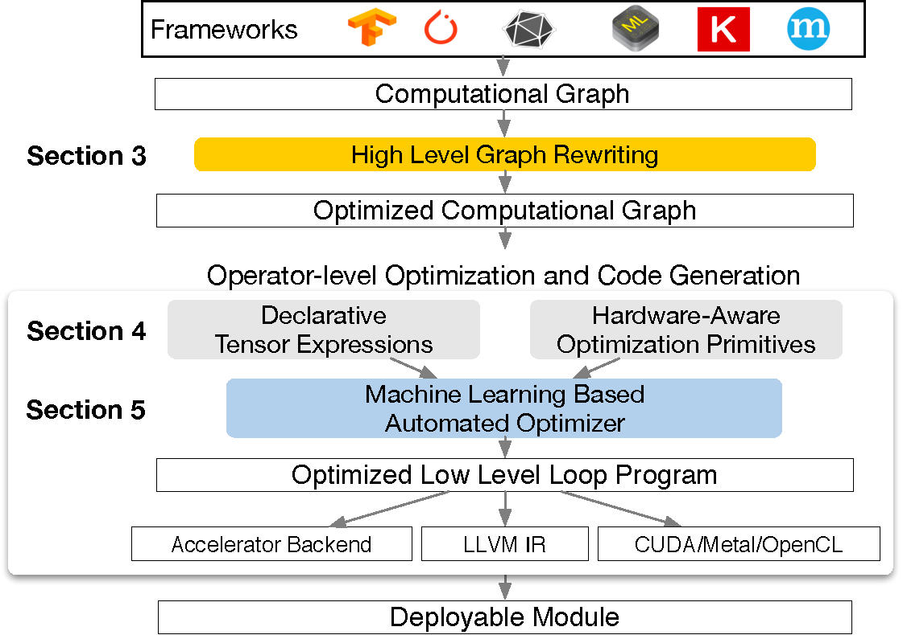

---
tags:
  - MLSYS
arxiv: "https://arxiv.org/abs/1802.04799"
github: "https://github.com/apache/tvm"
website: "https://tvm.apache.org"
year: 2018
read: false
---

# TVM: An Automated End-to-End Optimizing Compiler for Deep Learning

> **Links:** [arXiv](https://arxiv.org/abs/1802.04799) | [GitHub](https://github.com/apache/tvm) | [Website](https://tvm.apache.org)
> **Tags:** #MLSYS

---

## Methodology

TVM is an end-to-end deep learning compiler that takes models from existing frameworks (TensorFlow, MXNet, PyTorch, Keras, ONNX, CoreML) and generates optimized, deployable code for diverse hardware backends (CPUs, server GPUs, mobile GPUs, FPGAs, ASICs). It addresses two levels of optimization jointly:

### 1. Graph-Level Optimizations

The computational graph (nodes = tensor ops, edges = data dependencies) undergoes:

- **Operator fusion** — four categories of operators are recognized: injective (e.g., element-wise add), reduction (e.g., sum), complex-out-fusable (e.g., conv2d), and opaque (e.g., sort). Fusion rules: multiple injectives fuse together; reductions fuse with upstream injective ops; complex-out-fusable ops fuse downstream element-wise ops. Fused kernels eliminate intermediate memory writes, yielding **1.2x-2x** speedup on GPU.
- **Constant folding** — statically computable sub-graphs are pre-evaluated.
- **Static memory planning** — pre-allocate memory for each intermediate tensor.
- **Data layout transformation** — transforms internal layouts to match backend preferences; layout conversions are inserted at producer-consumer boundaries.

### 2. Tensor Operation Code Generation

TVM uses a **tensor expression language** (inspired by Halide) that separates *what* to compute from *how* to compute it. A **schedule** specifies the mapping to low-level code via composable primitives:

| Primitive | Purpose | Backend |
|---|---|---|
| `split`, `reorder`, `tile` | Loop tiling and reordering | CPU, GPU |
| `bind` | Map loops to GPU thread/block hierarchy | GPU |
| `cache_read/write` + memory scope | Cooperative shared memory fetching | GPU |
| `tensorize` | Replace computation unit with hardware intrinsic | Accelerators, CPU SIMD |
| Virtual threading + `pipeline` | Explicit latency hiding via decoupled access-execute (DAE) | TPU-like FPGAs |

**Tensorization** is extensible: each hardware intrinsic is declared with the same tensor expression language specifying behavior and lowering rules. The `tensorize` primitive pattern-matches computation to the declared intrinsic.

**Latency hiding** for DAE accelerators: the compiler introduces *virtual threads* to expose pipeline parallelism, then lowers the multi-threaded program to a single instruction stream with explicit synchronization tokens (enqueue/dequeue) for hardware to recover pipeline parallelism.

### 3. Automated Schedule Optimization (AutoTVM)

For each operator (specialized to its specific input shape/layout), TVM searches a schedule space of **billions of configurations** per operator. The automated optimizer has two components:

**ML-Based Cost Model:**
- Input: lowered loop program (AST or extracted features)
- **Gradient tree boosting (XGBoost)** — features: memory access counts, reuse ratios at each loop level, one-hot loop annotations (vectorize, unroll, parallel). Default model; prediction in **0.67 ms**.
- **TreeRNN** — summarizes loop AST via GRU-based tree RNN; no feature engineering. Similar quality but ~2x slower.
- Objective: **rank loss** (predict relative order of runtime, not absolute time).
- Model is periodically retrained on newly collected hardware measurements.

**Schedule Explorer:**
- **Parallel simulated annealing** over the configuration space, guided by cost model predictions.
- Iteratively: propose candidates -> predict -> select top-$k$ -> run on hardware -> retrain model.
- Bootstraps with random sampling when no training data exists.

**Distributed RPC Device Pool:**
- Compile on host, deploy and profile remotely across heterogeneous devices from a single script.
- Enables automated cross-compilation for embedded devices.

---

## Experiment Setup

- **Models:** ResNet-18, MobileNet (depthwise conv2d), LSTM language model, DQN, DCGAN
- **Hardware backends:**
  - Server GPU: NVIDIA Titan X
  - Embedded CPU: ARM Cortex A53 (Quad Core 1.2 GHz)
  - Embedded GPU: ARM Mali-T860MP4 (Firefly-RK3399)
  - FPGA: PYNQ board (ARM Cortex A9 667 MHz + Artix-7 FPGA, custom VDLA 16x16 matrix-vector unit at 200 MHz, ~102.4 GOPS/s peak)
- **Baselines:** MXNet v1.1 + cuDNN v7 + cuBLAS v8, TensorFlow v1.7 + cuDNN v7, TensorFlow XLA, TFLite (ARM A53), ARM Compute Library v18.03 (Mali GPU), TensorComprehensions (2000 trials/op), Caffe2 (ultra low-precision)
- **Implementation:** TVM core in C++ (~50k LoC); Python and Java bindings.

---

## Results

### Server GPU (NVIDIA Titan X) — End-to-End

| Model | TVM vs MXNet+cuDNN | TVM vs TF+cuDNN | TVM vs TF XLA |
|---|---|---|---|
| ResNet | ~1.6x | ~1.6x | ~1.2x |
| MobileNet | ~2x+ | ~2x+ | — |
| DQN | **3.8x** | **3.8x** | — |

DQN's large speedup is due to unconventional 4x4 conv2d (stride 2) not well-optimized by cuDNN.

### Embedded CPU (ARM A53) — End-to-End vs TFLite

TVM auto-generated operators outperform hand-optimized TFLite kernels for both ResNet and MobileNet.

**Ultra Low-Precision (2-bit activations, 1-bit weights) vs Caffe2:**

TVM single-threaded matches or exceeds Caffe2 hand-optimized library, particularly on 1x1 conv layers (C5, C8, C11) not optimized in Caffe2. Multi-threaded TVM adds further speedup.

### Embedded GPU (Mali-T860MP4) vs ARM Compute Library v18.03

| Model | float32 speedup | float16 speedup |
|---|---|---|
| ResNet | 1.2x–1.4x | 1.3x–1.6x |
| MobileNet | ~1.4x | ~1.6x |

### FPGA Accelerator (VDLA on PYNQ)

- Convolution layers offloaded to FPGA: **40x speedup** over ARM Cortex A9 CPU-only.
- Latency hiding: peak compute utilization improved from **70% to 88%**.

### ML Cost Model Comparison

| Method | Data Cost | Model Bias | Needs HW Info | Learns from History |
|---|---|---|---|---|
| Blackbox auto-tuning | High | None | No | No |
| Predefined cost model | None | High | Yes | No |
| **ML-based (TVM)** | **Low** | **Low** | **No** | **Yes** |

*Model bias = inaccuracy due to modeling assumptions. TVM's ML cost model finds better configurations faster than blackbox auto-tuning.*

---

## Related Papers

- [flashattn](flashattn.md)
- [dflash](dflash.md)
