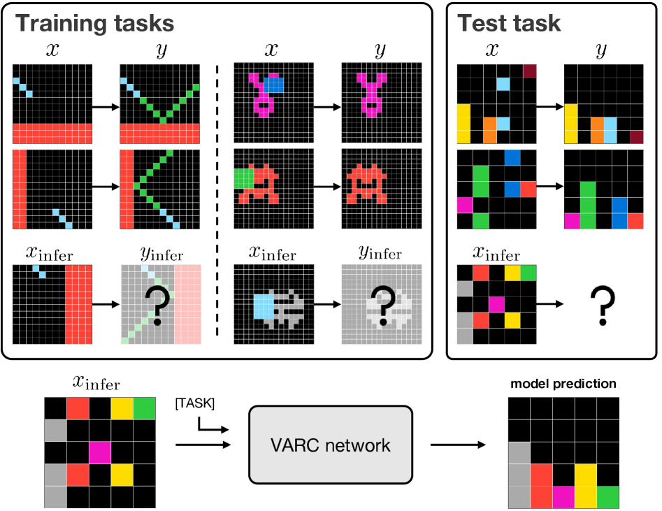

---
tags:
  - VISION
  - REASONING
  - TTT
arxiv: https://arxiv.org/abs/2511.14761
github: https://github.com/lillian039/VARC
website: https://github.com/lillian039/VARC
year: 2025
read: false
---

# ARC Is a Vision Problem!

> **Links:** [arXiv](https://arxiv.org/abs/2511.14761) | [GitHub](https://github.com/lillian039/VARC)
> **Tags:** #VISION #REASONING #TTT

---

## Methodology

VARC (Vision ARC) reframes the Abstraction and Reasoning Corpus (ARC) benchmark as an **image-to-image translation problem** and solves it with a vanilla Vision Transformer (ViT) augmented with visual inductive biases and test-time training.

### Canvas Representation

Each ARC task grid is placed on a **64x64 canvas** with a fixed background color. This uniform representation enables geometric augmentations (scale, translation) that are natural in vision but awkward in sequence-based models.

- Discrete pixel color indices (0-9 + background) are mapped to learnable continuous embeddings.
- Input divided into non-overlapping **2x2 patches** with linear projection.
- **2D separable positional embeddings**: independent learnable embeddings for row and column indices, avoiding the sequence-order bias of 1D sinusoidal PE.

### Architecture

A standard ViT with per-pixel cross-entropy output head:

$$\mathcal{L}(\theta) = \mathbb{E}_{T,i}\left[\mathcal{D}(y_i,\, f_\theta(x_i \mid T))\right]$$

- $T$: a test task (set of input-output demonstration pairs)
- $x_i, y_i$: input and output grids for example $i$
- $f_\theta$: the ViT model parameterized by $\theta$
- $\mathcal{D}$: per-pixel cross-entropy loss

**Default ViT configuration (18M params):**

| Hyperparameter | Value |
|----------------|-------|
| Hidden dim | 512 |
| Transformer blocks | 10 |
| Attention heads | 8 |
| Patch size | 2x2 |
| Canvas size | 64x64 |

### Test-Time Training (TTT)

For each unseen test task, VARC adapts the model by training on **51 auxiliary tasks** derived from the test task's demonstrations:

| Augmentation type | Count |
|-------------------|-------|
| Original task | 1 |
| Flips (horizontal, vertical) | 2 |
| Rotations (90 deg, 180 deg, 270 deg) | 3 |
| Color permutations (x10 each combination) | 45 |
| **Total** | **51** |

- 100 epochs, Adam (beta1=0.9, beta2=0.999), lr=3e-4, batch size 8
- ~0.7 seconds per epoch on a single H100 GPU

### Multi-View Inference

At inference, **510 augmented views** are generated per test task. Outputs are aggregated by **majority voting** (requiring pixel-identical agreement across all positions).

---

## Experiment Setup

**Offline training data:** 400 ARC-1 tasks + 1,000 RE-ARC pairs per task = ~400k samples total.

**Offline training config:**
- Optimizer: Adam (beta1=0.9, beta2=0.999)
- Learning rate: 3e-4 with cosine annealing
- Batch size: 32, 100 epochs, 10 warmup epochs

**Baselines:** HRM (recurrent, 27M), TRM (recurrent, 7M), DeepSeek R1, GPT-4o, o3-mini-high, Grok-4-thinking.

**Benchmarks:** ARC-1 (400 public evaluation tasks), ARC-2 (private held-out set).

---

## Results

### Main Results

| Model | Params | ARC-1 | ARC-2 |
|-------|--------|-------|-------|
| VARC (single) | 18M | 54.5% | 8.3% |
| VARC (ensemble) | 73M | **60.4%** | **11.1%** |
| HRM | 27M | 40.3% | 5.0% |
| TRM | 7M | 44.6% | 7.8% |
| DeepSeek R1 | 671B | 15.8% | 1.3% |
| GPT-4o | -- | 44.0% | 1.9% |
| o3-mini-high | -- | 34.5% | 3.0% |
| Grok-4-thinking | 1.7T | 66.7% | 16.0% |
| Average Human | -- | 60.2% | -- |

*ARC-1: public evaluation split (400 tasks). ARC-2: private held-out split. Single = one ViT (18M); ensemble = 4 models with majority voting (73M total). -- = not reported.*

### Ablation: Visual Priors

| Added component | Cumulative ARC-1 |
|-----------------|-----------------|
| Baseline (1D PE, 1x1 patches, no augmentation) | 26.8% |
| + 2D positional embedding | ~28% |
| + 2x2 patchification | ~31% |
| + Translation augmentation | ~34% |
| + Scale augmentation | ~54.5% |
| **Total gain** | **+27.7 pp** |

*pp = percentage points. Components are added cumulatively.*

### Ablation: Architecture

| Architecture | Params | ARC-1 |
|--------------|--------|-------|
| U-Net | 7M | 42.8% |
| U-Net | 17M | 47.5% |
| U-Net | 55M | 48.3% |
| ViT (default) | 18M | 54.5% |

### Ablation: Inference Strategy

| Inference mode | pass@1 | pass@2 |
|----------------|--------|--------|
| Single view | 35.9% | -- |
| 510 views (majority vote) | 49.8% | 54.5% |

*pass@1: single-attempt accuracy. pass@2: at least 1 of 2 attempts correct. -- = not applicable.*
