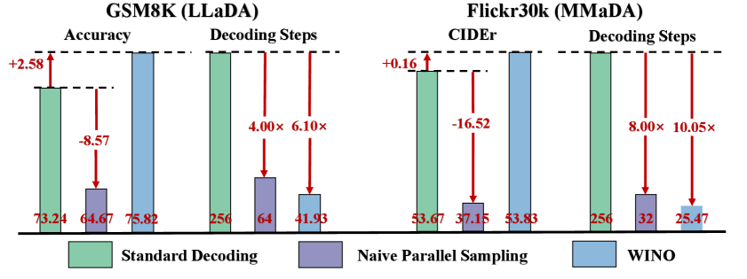

---
tags:
  - DLM
  - SPEC_DECODING
arxiv: https://arxiv.org/abs/2507.18578
github: https://github.com/Feng-Hong/WINO-DLLM
website: ""
year: 2025
read: true
---

# Wide-In, Narrow-Out: Revokable Decoding for Efficient and Effective DLLMs

> **Links:** [arXiv](https://arxiv.org/abs/2507.18578) | [GitHub](https://github.com/Feng-Hong/WINO-DLLM)
> **Tags:** #DLM #SPEC_DECODING

---

## Methodology

WINO (Wide-In, Narrow-Out) is a training-free decoding algorithm for Diffusion Large Language Models (DLLMs) that makes the decoding process **revokable**. Standard DLLM decoding is irreversible: once a token is unmasked, it remains fixed and early errors accumulate. WINO introduces a parallel **Draft-and-Verify** mechanism that allows previously decoded tokens to be re-masked and refined.

### Core Problem

Standard greedy decoding at step $k$ unmasks one token at position $l^{(k)}$:

$$l^{(k)} = \arg\max_{l \in \{l \mid y_l^{(k-1)} = [\text{MASK}]\}} \left( \max_{v \in V} p_\theta(\hat{y}_l = v \mid X, Y^{(k-1)}) \right)$$

- $k$: decoding step; $l$: sequence position; $V$: vocabulary.
- Inner $\max_v$: per-position max token probability (the position's "confidence"); outer $\arg\max_l$: over *still-masked* positions.
- $X$: prompt; $Y^{(k-1)}$: partial output from previous step; $\hat{y}_l = v$: the event "position $l$ is token $v$".
- Result: at each step unmask the single masked position the model is most confident about.

Naive parallel sampling unmasks $M > 1$ tokens simultaneously but causes severe accuracy degradation because early tokens are generated with sparse context and errors become permanently embedded.

### Drafting Phase

At step $k$, aggressively unmask any masked token whose max-probability exceeds a lenient threshold $\tau_1$:

$$y_{\text{cur},l}^{(k)} = \arg\max_{v \in V} p_\theta(\hat{y}_{\text{cur},l} = v \mid Y), \quad \text{if} \max_{v \in V} p_\theta > \tau_1 \text{ and } y_{\text{cur},l}^{(k-1)} = [\text{MASK}]$$

A low $\tau_1$ allows many tokens to be drafted in parallel, achieving speedup.

### Verification Phase (Shadow Block)

An auxiliary **shadow block** $Y_\text{shad} = [[\text{MASK}]] \times L_b$ is appended to the sequence, forming $\tilde{Y} = [Y_\text{left}, Y_\text{cur}, Y_\text{right}, Y_\text{shad}]$. The shadow block is assigned the **same position IDs** as $Y_\text{cur}$, enabling position-wise verification.

**Attention mask design:** Tokens in $Y_\text{shad}$ can attend to all tokens **except** their corresponding position in $Y_\text{cur}$, preventing information leakage. This guarantees $p_\theta(\hat{y}_{\text{cur},l} \mid Y) = p_\theta(\hat{y}_{\text{cur},l} \mid \tilde{Y})$ — the shadow block does not affect current-block predictions.

A previously decoded token is **re-masked** if the shadow block assigns it low confidence:

$$y_{\text{cur},l}^{(k)} = [\text{MASK}], \quad \text{if } p_\theta(\hat{y}_{\text{shad},l} = y_{\text{cur},l}^{(k-1)} \mid \tilde{Y}) < \tau_2 \text{ and } y_{\text{cur},l}^{(k-1)} \neq [\text{MASK}]$$

### Combined Update Rule (Eq. 4)

At decoding step $k$, for each position $l$ in $Y_\text{cur}$:

$$y_{\text{cur},l}^{(k)} = \begin{cases} \arg\max_{v \in V} p_\theta(\hat{y}_{\text{cur},l} = v \mid \tilde{Y}), & \text{if } \max_v p_\theta > \tau_1 \text{ and } y_{\text{cur},l}^{(k-1)} = [\text{MASK}] \\ [\text{MASK}], & \text{if } p_\theta(\hat{y}_{\text{shad},l} = y_{\text{cur},l}^{(k-1)} \mid \tilde{Y}) < \tau_2 \text{ and } y_{\text{cur},l}^{(k-1)} \neq [\text{MASK}] \\ y_{\text{cur},l}^{(k-1)}, & \text{otherwise} \end{cases}$$

Both drafting and verification complete in **a single forward pass** per step. The process is named "Wide-In" (lenient drafting: $\tau_1$ is small) and "Narrow-Out" (strict verification: $\tau_2$ is large), with $\tau_1 < \tau_2$.

---

## Experiment Setup

**Models:**
- Language tasks: LLaDA-8B-Instruct
- Vision-language tasks: MMaDA-8B-MixCoT

**Decoding paradigm:** Semi-autoregressive (SAR) — response split into blocks, decoded left-to-right; within each block, full diffusion decoding is applied.

**Key hyperparameters:**
- Generation length: 256; Block length $L_b$: 128 (default)
- $\tau_2 = 0.9$ (fixed across all experiments)
- $\tau_1 \in \{0.5, 0.6, 0.7\}$ (tuned per task; optimal range 0.5–0.7)
- $M = 4$ for GSM8K, $M = 8$ for Flickr30K (naive parallel sampling reference)

**Baselines:** Standard decoding (1 token/step), Naive Parallel Sampling ($M$ tokens/step)

**Metrics:** Accuracy (most tasks), CIDEr (Flickr30K); inference measured as Tokens Per Second (TPS) and Step Reduction ratio.

---

## Results

### Main Results — Language Benchmarks (LLaDA-8B-Instruct, Table 1)

| Benchmark | Method | Accuracy | Steps | Step Reduction | TPS | TPS Speedup |
|-----------|--------|----------|-------|---------------|-----|-------------|
| GSM8K | LLaDA | 73.24 | 256 | 1.00× | 17.76 | 1.00× |
| GSM8K | WINO | 75.82 (+2.58) | 41.93 | 6.10× | 100.53 | 5.66× |
| MATH-500 | LLaDA | 32.00 | 256 | 1.00× | 17.62 | 1.00× |
| MATH-500 | WINO | 34.20 (+2.20) | 74.44 | 3.44× | 55.86 | 3.17× |
| HumanEval | LLaDA | 37.80 | 256 | 1.00× | 14.52 | 1.00× |
| HumanEval | WINO | 42.07 (+4.27) | 93.32 | 2.74× | 37.19 | 2.56× |
| MBPP | LLaDA | 36.40 | 256 | 1.00× | 18.52 | 1.00× |
| MBPP | WINO | 36.40 (0.00) | 96.57 | 2.65× | 45.39 | 2.45× |
| Countdown | LLaDA | 24.21 | 256 | 1.00× | 17.22 | 1.00× |
| Countdown | WINO | 33.20 (+8.99) | 105.88 | 2.41× | 38.97 | 2.26× |
| Sudoku | LLaDA | 14.23 | 256 | 1.00× | 11.61 | 1.00× |
| Sudoku | WINO | 15.20 (+0.97) | 131.96 | 1.94× | 21.11 | 1.82× |
| ARC-E | LLaDA | 59.13 | 256 | 1.00× | 17.26 | 1.00× |
| ARC-E | WINO | 81.19 (+22.06) | 40.19 | 6.37× | 101.61 | 5.89× |
| ARC-C | LLaDA | 51.87 | 256 | 1.00× | 17.26 | 1.00× |
| ARC-C | WINO | 73.89 (+22.02) | 47.41 | 5.40× | 85.42 | 5.00× |

### Main Results — Vision-Language Benchmarks (MMaDA-8B-MixCoT, Table 2)

| Benchmark | Method | Performance | Steps | Step Reduction | TPS | TPS Speedup |
|-----------|--------|-------------|-------|---------------|-----|-------------|
| Flickr30K (CIDEr) | MMaDA | 53.67 | 256 | 1.00× | 6.41 | 1.00× |
| Flickr30K | WINO | 53.83 (+0.16) | 25.47 | 10.05× | 55.11 | 8.60× |
| AI2D | MMaDA | 54.86 | 256 | 1.00× | 6.31 | 1.00× |
| AI2D | WINO | 57.19 (+2.33) | 30.90 | 8.30× | 46.04 | 7.30× |
| MATH-Vision | MMaDA | 8.55 | 256 | 1.00× | 6.22 | 1.00× |
| MATH-Vision | WINO | 9.57 (+1.02) | 44.69 | 5.73× | 31.17 | 5.01× |
| MathVista-mini | MMaDA | 31.10 | 256 | 1.00× | 6.21 | 1.00× |
| MathVista-mini | WINO | 31.40 (+0.30) | 33.45 | 7.65× | 41.96 | 6.76× |
| MMMU-val | MMaDA | 18.56 | 256 | 1.00× | 6.02 | 1.00× |
| MMMU-val | WINO | 24.00 (+5.44) | 38.47 | 6.65× | 36.13 | 6.00× |
| ScienceQA | MMaDA | 30.89 | 256 | 1.00× | 6.07 | 1.00× |
| ScienceQA | WINO | 42.24 (+11.35) | 28.12 | 9.10× | 49.45 | 8.15× |

### Ablations

**Table 3 — Generation lengths and full diffusion decoding:**

| Setting | Benchmark | Gen. Len. | Block Len. | Method | Accuracy | Steps | Step Red. | TPS Speedup |
|---------|-----------|-----------|------------|--------|----------|-------|-----------|-------------|
| SAR | GSM8K | 256 | 128 | LLaDA | 73.24 | 256 | 1.00× | 1.00× |
| SAR | GSM8K | 256 | 128 | WINO | 75.82 | 41.93 | 6.10× | 5.66× |
| SAR | GSM8K | 512 | 128 | LLaDA | 74.60 | 512 | 1.00× | 1.00× |
| SAR | GSM8K | 512 | 128 | WINO | 79.91 | 68.53 | 7.47× | 6.98× |
| Full Diffusion | GSM8K | 128 | 128 | LLaDA | 53.94 | 256 | 1.00× | 1.00× |
| Full Diffusion | GSM8K | 128 | 128 | WINO | 62.32 | 23.95 | 5.34× | 4.92× |

**Table 4 — Ablation on verification module:**

| Benchmark | Method | Accuracy | Steps | Step Reduction | TPS Speedup |
|-----------|--------|----------|-------|---------------|-------------|
| GSM8K | LLaDA | 73.24 | 256 | 1.00× | 1.00× |
| GSM8K | Only Draft ($\tau_1=0.6$) | 70.28 | 34.79 | 7.36× | 7.37× |
| GSM8K | Only Draft ($\tau_1=0.9$) | 71.39 | 81.39 | 3.15× | 3.16× |
| GSM8K | WINO | 75.82 | 41.93 | 6.10× | 5.66× |
| MMMU-val | MMaDA | 18.56 | 256 | 1.00× | 1.00× |
| MMMU-val | Only Draft ($\tau_1=0.6$) | 19.89 | 35.63 | 7.18× | 7.18× |
| MMMU-val | Only Draft ($\tau_1=0.9$) | 18.74 | 79.74 | 3.21× | 3.22× |
| MMMU-val | WINO | 24.00 | 38.47 | 6.65× | 6.00× |

Verification is essential: without it, draft-only decoding degrades accuracy at aggressive $\tau_1$ and fails to match WINO at conservative $\tau_1$.

---

## Related Papers

- [mdlm](mdlm.md)
- [rcd](rcd.md)
- [dflash](dflash.md)
- [dmax](dmax.md)