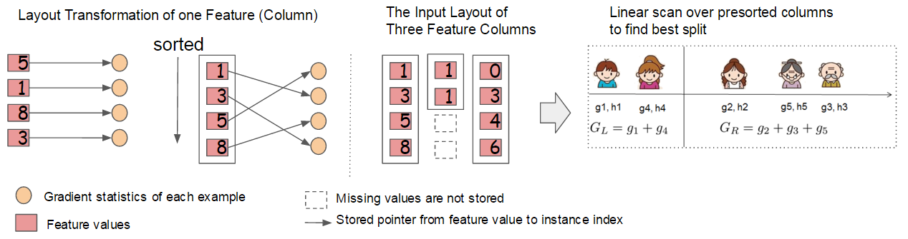

---
tags:
  - MLSYS
  - OPT
arxiv: https://arxiv.org/abs/1603.02754
github: "https://github.com/dmlc/xgboost"
website: ""
year: 2016
read: false
---

# XGBoost: A Scalable Tree Boosting System

> **Links:** [arXiv](https://arxiv.org/abs/1603.02754) | [GitHub](https://github.com/dmlc/xgboost)
> **Tags:** #MLSYS #OPT

---

## Methodology

*Block structure for parallel learning. Each column in a block is sorted by the corresponding feature value. A linear scan over one column is sufficient to enumerate all split points. Multiple blocks can be distributed across machines or stored on disk.*

### Regularized Learning Objective

XGBoost trains a tree ensemble $\hat{y}_i = \sum_{k=1}^K f_k(\mathbf{x}_i)$, where each $f_k$ is a regression tree (CART) with structure $q: \mathbb{R}^m \rightarrow T$ and leaf weights $w \in \mathbb{R}^T$. The regularized objective is:

$$\mathcal{L}(\phi) = \sum_i l(\hat{y}_i, y_i) + \sum_k \Omega(f_k), \quad \Omega(f) = \gamma T + \frac{1}{2}\lambda \|w\|^2$$

where $T$ is the number of leaves, $\gamma$ penalizes tree complexity (number of leaves), and $\lambda$ is an L2 regularization coefficient on leaf weights.

### Gradient Tree Boosting (Second-Order Approximation)

At step $t$, the per-step objective is approximated with a second-order Taylor expansion:

$$\tilde{\mathcal{L}}^{(t)} = \sum_{i=1}^n \left[g_i f_t(\mathbf{x}_i) + \frac{1}{2} h_i f_t^2(\mathbf{x}_i)\right] + \Omega(f_t)$$

- $i \in \{1,\ldots,n\}$: training instance; $\mathbf{x}_i$ its feature vector, $y_i$ its label.
- $g_i = \partial_{\hat{y}^{(t-1)}} l(y_i, \hat{y}^{(t-1)})$, $h_i = \partial^2_{\hat{y}^{(t-1)}} l(y_i, \hat{y}^{(t-1)})$: first- and second-order derivatives of the loss at the previous-round prediction $\hat{y}^{(t-1)}$ — treated as constants once round $t$ starts.
- $f_t$: the new tree being fit at round $t$; $f_t(\mathbf{x}_i)$ is its prediction for instance $i$.
- $q(\mathbf{x})$: tree structure — maps $\mathbf{x}$ to a leaf index; $I_j = \{i \mid q(\mathbf{x}_i) = j\}$ is the set of instances routed to leaf $j$.

For leaf set $I_j = \{i \mid q(\mathbf{x}_i) = j\}$, the optimal leaf weight and tree score are:

$$w_j^* = -\frac{\sum_{i \in I_j} g_i}{\sum_{i \in I_j} h_i + \lambda}$$

$$\tilde{\mathcal{L}}^{(t)}(q) = -\frac{1}{2} \sum_{j=1}^T \frac{(\sum_{i \in I_j} g_i)^2}{\sum_{i \in I_j} h_i + \lambda} + \gamma T$$

The gain from a candidate split (left set $I_L$, right set $I_R$, parent set $I = I_L \cup I_R$) is:

$$\mathcal{L}_{\text{split}} = \frac{1}{2}\left[\frac{(\sum_{i \in I_L} g_i)^2}{\sum_{i \in I_L} h_i + \lambda} + \frac{(\sum_{i \in I_R} g_i)^2}{\sum_{i \in I_R} h_i + \lambda} - \frac{(\sum_{i \in I} g_i)^2}{\sum_{i \in I} h_i + \lambda}\right] - \gamma$$

### Split Finding Algorithms

**Exact Greedy Algorithm:** Sorts all instances by each feature value and enumerates all possible splits, accumulating gradient statistics. Supported in single-machine settings.

**Approximate Algorithm (global and local variants):**
1. For each feature $k$, propose candidate split points $S_k = \{s_{k1}, \ldots, s_{kl}\}$ by percentiles of the feature distribution.
2. Map continuous features into buckets defined by candidate points and aggregate gradient statistics per bucket.
3. Find the best split among proposed candidates.

The *global* variant proposes candidates once at tree construction; the *local* variant re-proposes at each split. Local proposals need fewer candidates but incur more proposal steps.

### Weighted Quantile Sketch

For the approximate algorithm, candidate split points must weight instances by $h_i$. This is because the step-$t$ objective can be rewritten as:

$$\sum_{i=1}^n \frac{1}{2} h_i \left(f_t(\mathbf{x}_i) - g_i / h_i\right)^2 + \Omega(f_t) + \text{const}$$

revealing a weighted squared loss with labels $g_i / h_i$ and weights $h_i$. XGBoost proposes a novel **distributed weighted quantile sketch** with provable theoretical guarantees: a data structure supporting merge and prune operations that each maintain approximation error.

The goal is to find candidates such that $|r_k(s_{k,j}) - r_k(s_{k,j+1})| < \epsilon$, where $r_k(z) = \frac{\sum_{(x,h): x < z} h}{\sum_{(x,h)} h}$ is the weighted rank function. This yields roughly $1/\epsilon$ candidate points.

### Sparsity-Aware Split Finding

XGBoost handles missing values and sparse inputs (from missing entries, zero counts, or one-hot encoding) with a **default direction** at each tree node. For each feature $k$, only the non-missing entries $I_k$ are visited. The algorithm tries both left and right default directions for missing values and picks the direction with higher gain. Complexity is $O(\|\mathbf{x}\|_0)$ (linear in number of non-missing entries).

### System Design

**Column Block for Parallel Learning:**
- Data stored in in-memory blocks in CSC (Compressed Sparse Column) format, with each column pre-sorted by feature value.
- Sorting performed once before training, reused across all iterations.
- Exact greedy: entire dataset in one block; statistics for all leaf branches collected in a single linear scan.
- Multiple blocks can be distributed across machines (distributed) or written to disk (out-of-core).
- Time complexity: $O(Kd\|\mathbf{x}\|_0 + \|\mathbf{x}\|_0 \log n)$ vs. naive $O(Kd\|\mathbf{x}\|_0 \log n)$ — saves one $\log n$ factor via one-time pre-sort.

**Cache-Aware Access:**
- Block structure requires non-contiguous memory access (gradient stats fetched by row index in feature-sorted order), causing cache misses.
- *Exact greedy:* per-thread buffer prefetches gradient stats; accumulation done in mini-batches — ~2x speedup on large datasets.
- *Approximate:* block size of $2^{16}$ examples, balancing parallelization and cache utilization.

**Out-of-Core Computation:**
- Data divided into disk-resident blocks; a separate prefetch thread loads blocks into main-memory buffer concurrently with computation.
- *Block Compression:* columns compressed with a general-purpose codec; row indices stored as 16-bit offsets relative to block start. Achieves 26-29% compression ratio.
- *Block Sharding:* data sharded across multiple disks in alternating fashion; one prefetch thread per disk. ~2x additional throughput with two disks.

### Additional Regularization

- **Shrinkage:** newly added leaf weights scaled by step size $\eta$ after each boosting step.
- **Column (feature) subsampling:** random subset of features sampled at each split.

---

## Experiment Setup

**Datasets:**

| Dataset | $n$ | $m$ | Task |
|---|---|---|---|
| Allstate | 10M | 4,227 | Insurance claim classification |
| Higgs Boson | 10M | 28 | Event classification |
| Yahoo LTRC | 473K | 700 | Learning to rank |
| Criteo | 1.7B | 67 | Click-through rate prediction |

*$n$ = number of training instances, $m$ = number of features.*

**Hardware:**
- Single-machine: Dell PowerEdge R420, two 8-core Intel Xeon E5-2470 (2.3 GHz), 64 GB RAM.
- Out-of-core: AWS c3.8xlarge (32 vcores, 2x320 GB SSD, 60 GB RAM).
- Distributed: YARN on EC2 m3.2xlarge nodes (8 vcores, 30 GB RAM, 2x80 GB SSD each).

**Common hyperparameters:** max depth = 8, shrinkage $\eta = 0.1$, no column subsampling unless specified.

---

## Results

### Single Machine: Exact Greedy (Higgs-1M, 500 Trees)

| Method | Time per Tree (sec) | Test AUC |
|---|---|---|
| XGBoost | 0.684 | 0.8304 |
| XGBoost (colsample=0.5) | 0.640 | 0.8245 |
| scikit-learn | 28.51 | 0.8302 |
| R GBM | 1.032 | 0.6224 |

*R GBM expands only one branch per tree (faster but less accurate); scikit-learn and XGBoost learn full trees. colsample = column subsampling ratio (fraction of features used per split).*

### Learning to Rank (Yahoo! LTRC, 500 Trees)

| Method | Time per Tree (sec) | NDCG@10 |
|---|---|---|
| XGBoost | 0.826 | 0.7892 |
| XGBoost (colsample=0.5) | 0.506 | 0.7913 |
| pGBRT | 2.576 | 0.7915 |

*pGBRT uses approximate splitting only; XGBoost uses exact greedy. NDCG@10 = Normalized Discounted Cumulative Gain at rank 10.*

### System Feature Comparison

| System | Exact Greedy | Approx Global | Approx Local | Out-of-Core | Sparsity-Aware | Parallel |
|---|---|---|---|---|---|---|
| **XGBoost** | yes | yes | yes | yes | yes | yes |
| pGBRT | no | no | yes | no | no | yes |
| Spark MLLib | no | yes | no | no | partially | yes |
| H2O | no | yes | no | no | partially | yes |
| scikit-learn | yes | no | no | no | no | no |
| R GBM | yes | no | no | no | partially | no |

### Out-of-Core (Criteo, Single AWS c3.8xlarge Machine)

| Method | Relative Throughput |
|---|---|
| Baseline (no compression, single disk) | 1x |
| + Block Compression | ~3x |
| + Block Compression + 2-disk Sharding | ~6x |

### Distributed (Criteo, 32 EC2 m3.2xlarge Nodes, 10 Iterations)

- XGBoost is >10x faster than Spark MLLib per iteration.
- XGBoost is ~2.2x faster than H2O per iteration.
- XGBoost scales to full 1.7B examples; Spark and H2O can only handle subsets with given resources.
- Linear scaling as number of machines increases; 1.7B dataset processable with as few as 4 machines.

### Ablations

| Ablation | Result |
|---|---|
| Sparsity-aware vs. naive (Allstate-10K, one-hot sparse data) | >50x faster |
| Cache-aware vs. naive prefetching (exact greedy, 10M instances) | ~2x faster |
| Cache-aware vs. naive prefetching (exact greedy, 1M instances) | negligible difference |
| Block size $2^{16}$ for approximate algorithm | optimal cache/parallelism tradeoff |
